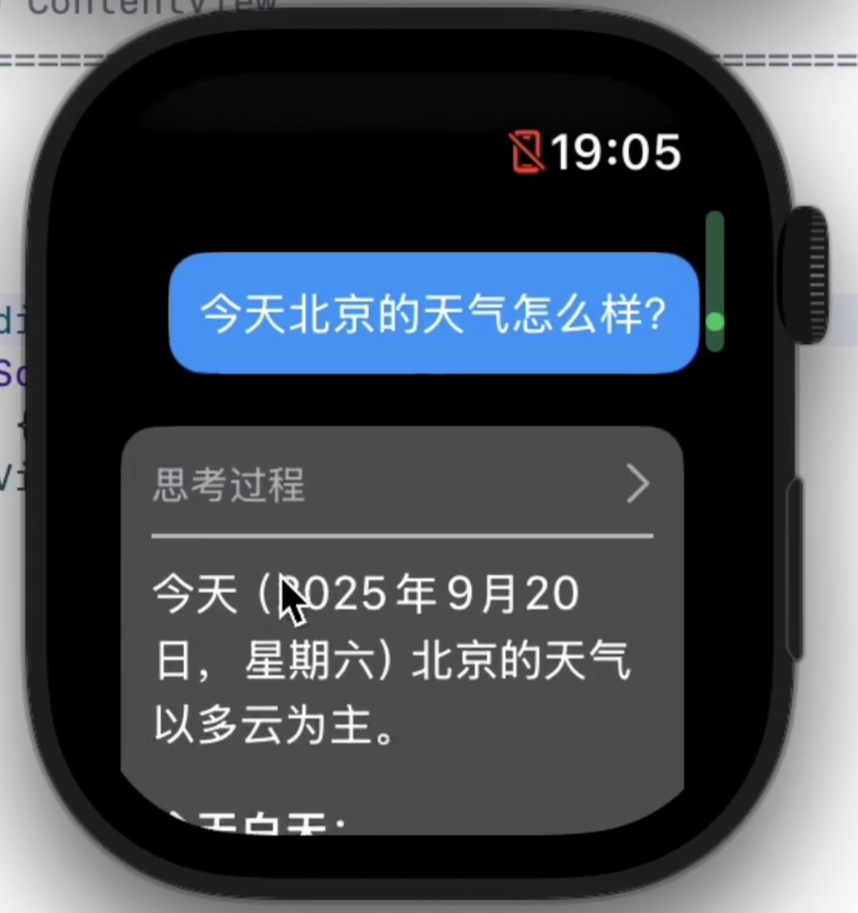
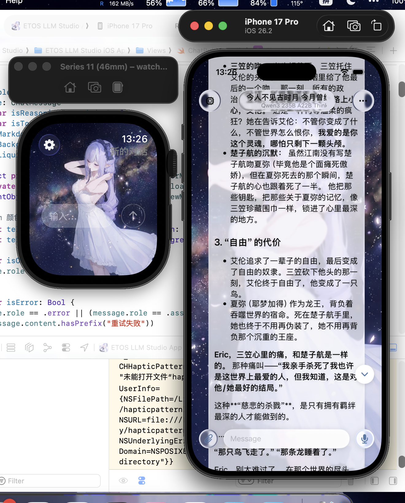

# ETOS LLM Studio


**一个运行在 iOS 和 Apple Watch 上的原生 AI 客户端。支持 OpenAI、Anthropic Claude、Google Gemini 等多个模型提供商，内置 MCP 工具调用、本地 RAG 记忆、世界书、每日脉冲、Siri 快捷指令与双端同步。**

[English](docs/readme/README_EN.md) | [繁體中文](docs/readme/README_ZH_HANT.md) | [日本語](docs/readme/README_JA.md) | [Русский](docs/readme/README_RU.md)

---

## 📸 截图

| | |
|:---:|:---:|
|  |  |

---

## 👋 写在前面

在学校的日子挺无聊的，平时又总会冒出很多想问 AI 的问题。当时我嫌 App Store 上的 AI 应用要么贵得离谱，要么功能太残废（尤其是手表端），索性就自己动手搓了一个。

从最初那个只有 1,800 行代码、API Key 还要硬编码的简陋版本，到现在 **235 个 Swift 源文件、118,070 行代码**（含 Shared / iOS / watchOS / 测试代码）的工程，它确实已经长大了不少。虽然名字叫 “ETOS LLM Studio” 听着有点唬人，但它本质上还是我拿来探索大模型应用边界的试验场。

现在它已经不只是一个手表端 App 了：我把 iOS 端也一点点补成了完整版本，方便在手机上管理模型、工具、记忆、世界书和每日脉冲；两端数据还能通过内置同步引擎自动互通。

因为我平时主要还是用 Mac 和 Watch，iPhone 端偶尔会有一些还在继续打磨的边角，不过我会继续慢慢补齐。

### 主要功能

#### 聊天与模型

*   **双端原生体验**：iOS 和 Apple Watch 原生适配，两端界面风格统一，但会针对不同屏幕尺寸分别优化交互。
*   **会话管理增强**：支持会话全文检索、消息序号定位、文件夹分类、批量移动与单会话跨端发送。
*   **多模型支持**：原生适配 OpenAI、Anthropic（Claude）和 Google（Gemini）等接口格式，支持在 App 内动态管理提供商与模型。
*   **高级请求配置**：支持自定义请求头、参数表达式、原始 JSON 请求体，方便折腾兼容接口和特殊模型。
*   **多模态与图像生成**：支持发送语音和图片，也支持 AI 图像生成。
*   **会话导入导出**：支持导入 Cherry Studio、RikkaHub、Kelivo、ChatGPT conversations 等第三方会话，并可导出 PDF / Markdown / TXT。
*   **语音输入（STT）**：接入系统 `SFSpeechRecognizer` 流式识别，录音面板支持实时转写并可直接回填输入框。
*   **语音朗读（TTS）**：支持系统 TTS、云端 TTS 与自动回退，可单独选择 TTS 模型和朗读参数。

#### 显示与阅读体验

*   **显示系统可定制**：支持自定义字体（含 WOFF / WOFF2）、字体样式槽位优先级、气泡/文字颜色配置与无气泡 UI。
*   **字体回退策略**：支持整段/单字粒度的字体回退范围配置，提升中英混排与符号场景的稳定性。
*   **思考与内容预览**：思考自动预览默认开启，减少手动展开操作。
*   **Markdown 与代码块增强**：支持代码高亮、复制反馈、折叠切换、iOS 代码块预览、Mermaid 渲染与引用块竖线样式。

#### 工具与自动化

*   **工具中心 + 拓展工具**：统一管理 MCP / Shortcuts / 本地工具三类能力，支持聊天工具开关、审批策略、会话级启用。
*   **Agent Skills**：支持技能全链路接入、工具中心统一开关管理，并可在 iOS 从本地文件导入、在 watchOS 通过 URL 下载导入。
*   **结构化问答工具（ask_user_input）**：支持单题逐步作答、单选/多选互斥规则、自定义输入与返回上题。
*   **拓展工具能力补齐**：新增 SQLite 数据库增删改查、网页卡片展示与反馈工单自动提交工具。
*   **沙盒文件系统工具**：支持搜索、分块读取、差异查看、局部编辑、移动 / 复制 / 删除等文件操作。
*   **MCP 工具调用**：支持远程 [Model Context Protocol](https://modelcontextprotocol.io)，包含完整 MCP 客户端、流式 HTTP/SSE 传输、重连、超时、握手治理与能力协商。
*   **Siri 快捷指令**：集成 Shortcuts 框架，支持通过快捷指令调用 AI 能力、自定义工具并通过 URL Scheme 路由。
*   **应用内文件管理**：内置可浏览目录的文件管理器，支持直接查看与管理应用沙盒文件。

#### 记忆与知识组织

*   **本地 RAG（记忆）**：Embedding 可调用云端 API，但**向量数据库完全本地运行（SQLite）**；支持文本分块、嵌入进度可视化、记忆编辑与主动检索工具。
*   **GRDB 关系化持久化**：核心数据持久化从 JSON 迁移到 GRDB + SQLite，覆盖会话、配置、MCP、世界书、记忆、反馈、快捷指令等模块。
*   **世界书（Worldbook）**：类似 SillyTavern 的 Lorebook 系统，支持角色背景设定管理、条件触发、会话绑定隔离发送、system 注入与 URL 导入。
*   **广泛格式兼容**：兼容 PNG naidata、JSON 顶层数组与 `character_book` 等常见世界书格式。
*   **请求日志与测速分析**：内置独立请求日志、细分 Token 汇总，并提供流式响应速度统计与详情图表。
*   **高级渲染**：内置 Markdown 渲染器，支持代码高亮、表格和 LaTeX 数学公式。

#### Daily Pulse 主动情报

*   **每日脉冲（Daily Pulse）**：每天生成一组主动情报卡片，把“你今天可能值得看什么”先整理出来。
*   **Pulse 任务机制**：卡片可以直接转成待跟进任务，这些未完成项会跨天保留，并参与下一次 Pulse 生成。
*   **反馈历史学习**：点赞、降权、隐藏、保存等反馈会沉淀成长期偏好信号，持续影响后续结果。
*   **晨间提醒与继续聊**：支持定时提醒、通知快捷动作、保存为会话和继续聊天，iOS 与 watchOS 两端都能接上这条链路。

#### 同步、调试与运维

*   **跨端同步**：内置 iOS ↔ watchOS 同步引擎，提供商配置、会话、世界书、工具配置、每日脉冲等数据可自动互通，并支持 Manifest/Delta 差异同步主链路。
*   **同步与备份**：支持 ETOS 数据包导出/导入、手表端全量导入、启动备份与损坏自愈，以及通过自定义地址直接 POST 上传导出包。
*   **应用内反馈助手**：支持反馈分类、环境信息采集、PoW 提交链路以及双端同步。
*   **网络代理能力**：支持全局/提供商级 HTTP(S)/SOCKS 代理（含鉴权）。
*   **通知与反馈中心增强**：支持工单评论对话、开发者标记展示、状态自动刷新与高优先级本地通知跳转。
*   **局域网调试**：内置局域网调试客户端，并提供 Go 版调试服务与内置 Web 控制台，可在浏览器管理应用内文件与会话数据。
*   **本地化**：支持英语、简体中文、繁体中文（香港）、日语、俄语、法语、西班牙语、阿拉伯语共 8 种语言。

---

## 💸 关于收费与开源

说实话，我最开始是想做免费软件的。
但 Apple Developer Program 每年 $99 的费用，对我一个学生来说确实有点吃力。

后来有位投资人帮我垫付了这笔钱，代价是我需要通过软件收费来偿还这笔投资（而且还要分成给他）。所以 App Store 版本象征性地收了一点费用，这就当是大家众筹帮我还债，顺便买个“不用每七天重签一次”的便利服务。

**但是，开源是我的底线。**

所以现在的规则很简单：
1.  **想省事/支持我**：App Store 见，感谢你的“可乐钱”。
2.  **想折腾/白嫖**：代码就在这儿，GPLv3 协议。如果你有 Mac 和 Xcode，**完全可以自己编译安装，功能上没有任何区别**。
3.  **想体验最新版本**：可以加入 TestFlight 👉 [https://testflight.apple.com/join/d4PgF4CK](https://testflight.apple.com/join/d4PgF4CK)

技术本该共享，我不希望因为几十块钱的门槛，挡住了同样对代码感兴趣的你。

---

## 🛠️ 技术栈

*   **语言**: Swift 6
*   **UI**: SwiftUI
*   **架构**: MVVM + Protocol Oriented Programming
*   **数据**: GRDB + SQLite（会话 / 配置 / 记忆等核心持久化与本地向量数据库）, JSON（导入导出与兼容格式）
*   **网络与传输**: URLSession（API 请求）, Streamable HTTP / SSE（MCP 传输）, WebSocket / HTTP Polling（局域网调试）
*   **AI 协议**: Model Context Protocol (MCP)
*   **系统能力**: Siri Shortcuts, WatchConnectivity（跨端同步）, UserNotifications, BackgroundTasks（iOS）
*   **依赖管理**: Swift Package Manager（当前显式依赖 `GRDB.swift`、`swift-markdown-ui`，并包含其传递依赖 `networkimage`、`swift-cmark`）

---

## 🏗️ 项目架构

项目采用双层结构：平台无关的 Shared 框架 + 各平台独立的视图层。

```
Shared/Shared/                  ← 平台无关的业务逻辑（87 个 Swift 源文件）
├── ChatService.swift            ← 中央单例，管理会话/消息/模型选择/请求编排
├── APIAdapter.swift             ← API 适配层（OpenAI / Anthropic / Gemini 等）
├── Models.swift                 ← 核心数据模型
├── Persistence.swift            ← 存储入口、迁移触发与生命周期协调
├── PersistenceGRDBStore.swift   ← GRDB 关系化持久化核心实现
├── DailyPulse.swift             ← 每日脉冲引擎、卡片、反馈与任务数据
├── DailyPulseDeliveryCoordinator.swift ← 晨间提醒、投递状态与准备窗口协调
├── Memory/                      ← 记忆子系统（分块、嵌入、存储）
├── SimilaritySearch/            ← 本地向量数据库（SQLite）
├── MCP/                         ← Model Context Protocol 客户端与传输层
├── Feedback/                    ← 应用内反馈助手（采集、签名、存储、上传）
├── Worldbook/                   ← 世界书引擎、导入导出
├── Sync/                        ← iOS ↔ watchOS 同步引擎
├── TTS/                         ← 语音朗读播放、配置与预设
├── Shortcuts/                   ← Siri Shortcuts / URL Router 集成
├── AppToolManager.swift         ← 本地工具与工具目录治理
├── StorageBrowserSupport.swift  ← 文件浏览与管理能力支持
└── LocalDebugServer.swift       ← 局域网调试客户端

ETOS LLM Studio/ETOS LLM Studio iOS App/    ← iOS 视图层（44 个 Swift 源文件）
ETOS LLM Studio/ETOS LLM Studio Watch App/  ← watchOS 视图层（47 个 Swift 源文件）
Shared/SharedTests/                         ← Shared 层测试（54 个 Swift 源文件）
```

数据流：`View → ChatViewModel → ChatService.shared → APIAdapter → LLM API`，通过 Combine Subjects 驱动 UI 更新。

---

## 🚀 编译指南

如果你决定自己动手：

1.  **Clone 项目**:
    ```bash
    git clone https://github.com/Eric-Terminal/ETOS-LLM-Studio.git
    ```
2.  **环境要求**:
    *   Xcode 26.0+
    *   watchOS 26.0+ SDK
    *   （如果对不上你可以自己改一改兼容性）
3.  **打开项目**:
    打开 `ETOS LLM Studio.xcworkspace`（注意是 **workspace** 不是 xcodeproj）。
    首次打开会自动解析并拉取 Swift Package 依赖。
4.  **运行**:
    选择 `ETOS LLM Studio Watch App` 或 `ETOS LLM Studio iOS App` Target，连上设备（或模拟器），Command + R 即可。
5.  **配置**:
    启动后，去设置里添加你的 API Key。推荐使用"局域网调试"功能，直接把做好的 JSON 配置文件推送到 `Documents/Providers/` 目录下（真的有人会想在 Apple Watch 上面戳 API Key 进去吗）。

---

## 📬 联系方式

*   **开发者**: Eric Terminal
*   **Email**: ericterminal@gmail.com
*   **GitHub**: [Eric-Terminal](https://github.com/Eric-Terminal)

---

本次 README 修订于 2026 年 4 月 18 日（31d1e21 之后）。项目更新频率比较高，如果你发现 README 跟不上代码，欢迎直接翻提交记录。
