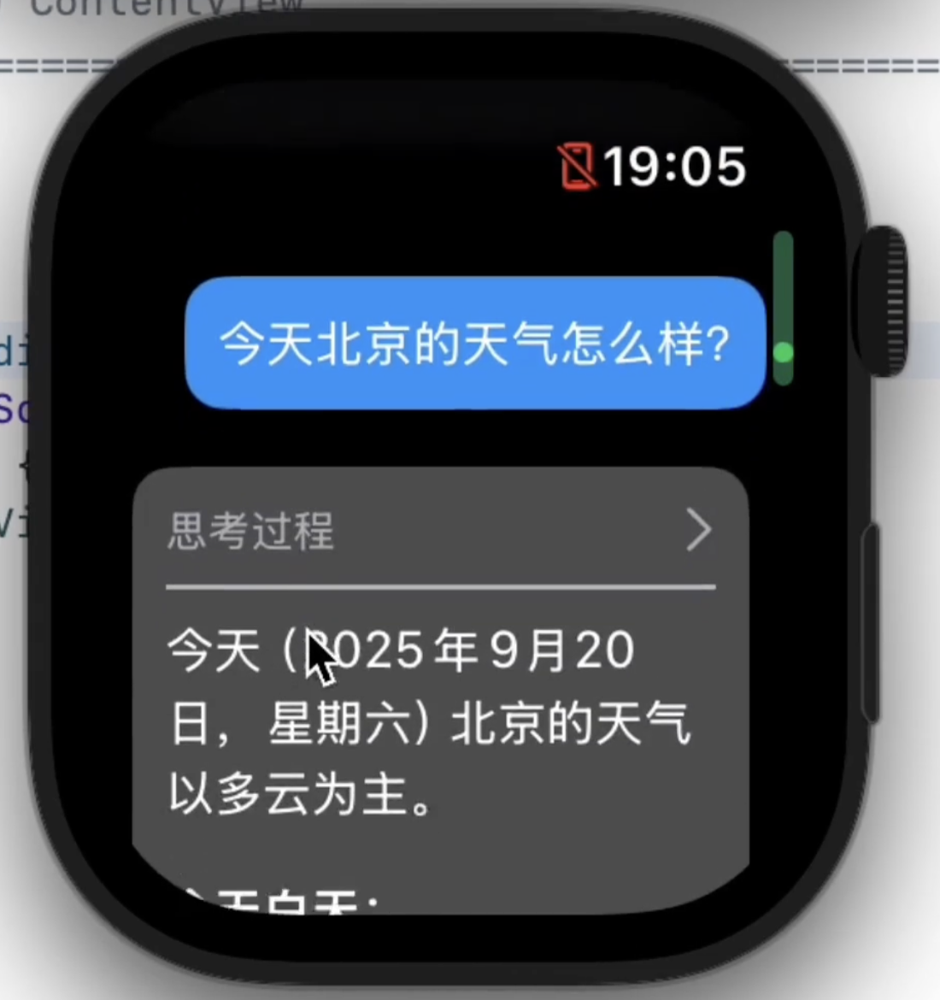
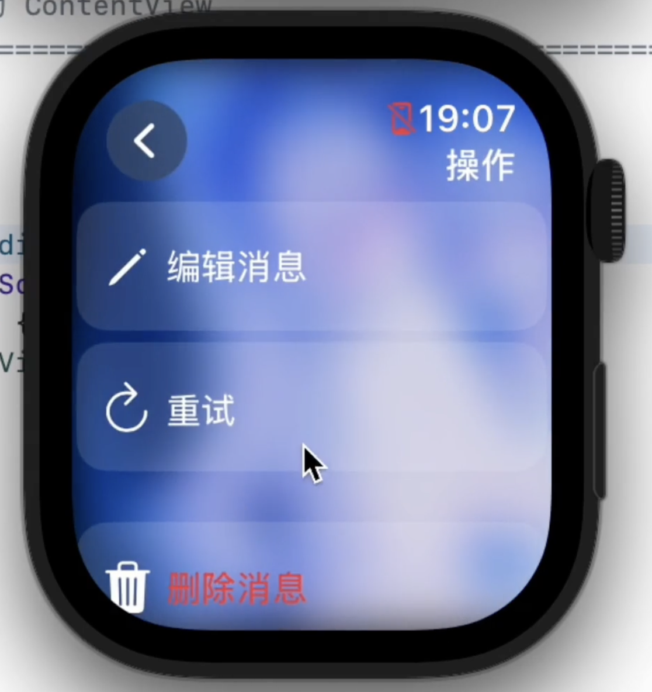

# ETOS LLM Studio

[](https://swift.org)
[](https://developer.apple.com/watchos/)
[](LICENSE.txt)

**一个功能强大、高度可定制的原生 AI 聊天客户端，专为 iOS 和 Apple Watch 设计。**

> [!NOTE]
> **项目状态说明：** 目前 iOS 版本的 UI 尚未完全开发，但 watchOS 版本功能完善，可正常使用。

## 🎥 演示视频

<video src="https://private-user-images.githubusercontent.com/121368508/493718773-557021ed-fe65-4ece-a300-dbfb2a7b0f45.mp4?jwt=eyJ0eXAiOiJKV1QiLCJhbGciOiJIUzI1NiJ9.eyJpc3MiOiJnaXRodWIuY29tIiwiYXVkIjoicmF3LmdpdGh1YnVzZXJjb250ZW50LmNvbSIsImtleSI6ImtleTUiLCJleHAiOjE3NTg3NzgyNDMsIm5iZiI6MTc1ODc3Nzk0MywicGF0aCI6Ii8xMjEzNjg1MDgvNDkzNzE4NzczLTU1NzAyMWVkLWZlNjUtNGVjZS1hMzAwLWRiZmIyYTdiMGY0NS5tcDQ_WC1BbXotQWxnb3JpdGhtPUFXUzQtSE1BQy1TSEEyNTYmWC1BbXotQ3JlZGVudGlhbD1BS0lBVkNPRFlMU0E1M1BRSzRaQSUyRjIwMjUwOTI1JTJGdXMtZWFzdC0xJTJGczMlMkZhd3M0X3JlcXVlc3QmWC1BbXotRGF0ZT0yMDI1MDkyNVQwNTI1NDNaJlgtQW16LUV4cGlyZXM9MzAwJlgtQW16LVNpZ25hdHVyZT0xNzMyYTgyYzgwNjA3NzNkNDExMDI2ODI3NzQ5NDk1ODZkNDUyYzg2YjY5MWQ2NjFhMDVmZTIyOTNiZjIxY2ZiJlgtQW16LVNpZ25lZEhlYWRlcnM9aG9zdCJ9.SAxneOrVjRJ1VdjKyJmZiavayKqOz5nUdMdFuS8PxGE" controls="controls" muted="muted" style="max-width: 100%;"></video>

## 📸 截图 (Screenshots)

| | |
|:---:|:---:|
|  |  |
|  |  |
|  |  |
|  |  |

---

## ✨ 功能特性

<details>
<summary><strong>🚀 核心架构与自定义能力</strong></summary>

- 🎯 **原生双端体验**: 基于 SwiftUI 构建，为 watchOS 和 iOS 提供流畅、统一的交互体验。
- 🔧 **完全解耦的 API 配置**: 已彻底移除硬编码的 API 设置。用户现在可以直接在 App 内部（设置 -> 模型设置 -> 提供商列表）动态添加、编辑和管理不同的 API 提供商和模型。
    - **实现细节**: 该功能通过将 `Provider` 和 `Model` 对象进行 `Codable` 序列化，以 JSON 格式持久化存储在本地 `Documents/Providers` 目录下，应用启动时通过 `ConfigLoader` 动态加载，实现了高度可扩展的配置管理。
- 🔌 **适配器模式 (Adapter Pattern)**: 采用适配器模式构建网络层，为不同服务商的 API 请求和响应格式创建统一的内部接口。
    - **实现细节**: `OpenAIAdapter` 作为具体实现，负责将应用内部的 `ChatMessage` 和 `InternalToolDefinition` 等标准模型，“翻译”成 OpenAI 兼容的 JSON 结构（包括复杂的 `tools` 和 `tool_choice` 字段），并在收到响应后反向翻译回来。这种设计极大地降低了核心逻辑与特定 API 的耦合度。
- 🔑 **API Key 轮换**: 在配置了多个 API Key 的情况下，应用每次发起请求时会随机选择一个使用，便于利用多个免费额度或实现简单的负载均衡。

</details>

<details>
<summary><strong>🧠 记忆系统 (类 RAG 功能)</strong></summary>

- **内置记忆系统**: 项目独立实现了一套与检索增强生成（RAG）原理类似的记忆系统。AI 在响应前，会先根据用户输入检索相关记忆，并将结果注入到提示词中，从而实现跨会话的长期记忆。
- **完全离线与私密的向量化**:
    - **实现细节**: 整个 RAG 流程**完全在设备端离线运行**，不依赖任何外部服务。它使用苹果原生的 **NaturalLanguage 框架** (`NLEmbedding`) 来生成文本的向量表示（Embeddings），确保了用户数据的绝对私密性。
- **自研的相似度搜索引擎**:
    - **实现细节**: 整个搜索功能基于一个轻量级的自研引擎。`SimilarityIndex` 作为核心协调器，管理着内存中的向量索引；`NativeEmbeddings` 负责调用 `NaturalLanguage` 框架进行文本向量化；`CosineSimilarity` 算法用于计算查询与记忆之间的相似度；最终，所有记忆向量通过 `JsonStore` 以 JSON 文件的形式持久化存储在本地。
- **简洁的管理器与可配置性**:
    - **实现细节**: `MemoryManager` 作为 `SimilarityIndex` 的一个简洁包装层 (Wrapper)，通过 `Combine` 框架将记忆的变更响应式地发布给 UI，并使用后台队列 (`DispatchQueue`) 异步执行耗时的持久化操作，避免阻塞主线程。同时，用户可以在设置中**自定义检索数量 (Top K)**，以控制注入上下文的记忆条数。

</details>

<details>
<summary><strong>🤖 AI 智能体 (Agent) 与提示工程</strong></summary>

- **工具调用 (Tool Use)**: AI 可以调用应用内置的工具。目前已实现 `save_memory` 工具，允许 AI 在对话中自主判断信息价值，并主动调用该工具将关键信息存入长期记忆库。
- **三层提示词系统**:
    - **实现细节**: 通过将“全局系统提示词”、“会话主题提示词”和“单次增强提示词”组合成一个 XML 风格的结构化提示词（例如使用 `<system_prompt>`、`<topic_prompt>` 标签包裹），实现了对 AI 行为的精细化、分层化控制。
- **自动会话命名**: 在新会话的前两次交互后，应用会自动调用 AI，根据对话内容生成一个简短精炼的标题，提升了会话的可管理性。

</details>

<details>
<summary><strong>💬 强大的会话与消息管理</strong></summary>

- 💾 **多会话管理**: 支持创建、保存和管理多个独立的聊天会话。
- 🌿 **会话分支**: 可以从现有会话的任意节点创建新分支，方便进行对比和探索性提问。
- 📝 **Markdown 渲染**: 消息支持 Markdown 格式，代码、列表等排版更美观。
- ✏️ **消息编辑与重试**: 可以随时编辑已发送的消息或 AI 的回复，也可以一键重新生成 AI 的最后一次回复。

</details>

---

## 🚀 未来计划 (Roadmap)

我们正在积极规划和开发以下激动人心的新功能：

<details>
<summary><strong>🖼️ 多模态输入支持</strong></summary>

- 计划为支持多模态的大语言模型增加**图像或音频输入**功能。届时，在“自定义参数”设置区域将增加“允许图像/音频输入”的开关选项。

</details>

<details>
<summary><strong>🌐 API 兼容性与参数自定义增强</strong></summary>

- **更广泛的 API 支持**: 将通过适配器模式，增加对 **Anthropic (Claude)** 和 **Google (Gemini)** 等主流 API 格式的兼容。
- **完善参数自定义**: 针对目前 watchOS 原生键盘无法输入标准双引号，导致自定义 JSON 参数解析失败的问题，未来将通过引入特定的表达式语法，在发送前对用户输入的参数进行转义处理，以实现完整的、跨平台的参数自定义功能。

</details>

<details>
<summary><strong>🛠️ 工具调用与系统集成</strong></summary>

- **远程 MCP 支持**: 计划加入对远程 MCP (模型上下文协议) 的支持，以扩展 AI 与外部工具和服务的交互能力。
- **调用快捷指令 (Shortcuts)**: 将支持通过 `URL Scheme` 调用 iOS/watchOS 的**快捷指令**，以完成更复杂、自动化的操作流程。
- **获取健康数据**:
    > [!IMPORTANT]
    > 在用户明确授权后，允许 AI 通过工具调用获取心率等健康数据。**所有操作均在用户知情和授权下进行，应用本身不会主动获取或存储任何隐私数据。**

</details>

<details>
<summary><strong>📬 主动推送信息功能</strong></summary>

- **引入主动简报功能 (类 ChatGPT Pulse)**: 计划实现类似 ChatGPT Pulse 的功能，允许 AI 根据用户偏好，定期主动推送个性化的信息摘要或“早报”。

</details>

---

## 🛠️ 技术栈

- **UI**: **SwiftUI**。完全采用苹果的声明式 UI 框架，确保了在 iOS 和 watchOS 上的代码复用和原生体验。
- **响应式编程**: **Combine**。项目的核心 `ChatService` 和 `MemoryManager` 大量使用 Combine 框架，通过 `CurrentValueSubject` 和 `PassthroughSubject` 等发布者（Publishers）来驱动 UI 的响应式更新，实现了高效、可靠的异步状态管理。
- **设备端机器学习**: **NaturalLanguage Framework**。利用苹果原生的自然语言处理框架实现文本的**设备端向量化 (On-Device Embedding)**，是整个 RAG 系统能够离线、私密运行的核心。
- **网络**: **URLSession**。利用现代 Swift 的 `async/await` 特性处理网络请求，并通过 `URLSession.bytes` 实现对流式响应（Streaming Response）的高效处理。
- **数据持久化**: **FileManager & Codable**。
    - **实现细节**: 构建了一套健壮的文件持久化系统。所有用户配置和数据均以 JSON 格式存储在应用的 `Documents` 目录中。会话列表 (`sessions.json`)、每个会话的消息 (`{sessionID}.json`)、API 提供商配置 (`Providers/{providerID}.json`) 和记忆向量库 (`etos-memory-index.json`) 都被清晰地分离存储，确保了数据的完整性、独立性和隐私性。
- **Markdown 渲染**: [**MarkdownUI**](https://github.com/gonzalezreal/swift-markdown-ui)。一个轻量且强大的库，用于在 SwiftUI 中优雅地渲染 Markdown 文本。
- **依赖管理**: **Swift Package Manager (SPM)**。

## 🚀 快速开始

由于所有 API 和应用配置都已移至 App 内完成，因此上手变得非常简单。

1.  **克隆项目**
    ```bash
    git clone https://github.com/Eric-Terminal/ETOS-LLM-Studio.git
    cd ETOS-LLM-Studio
    ```

2.  **编译运行**
    在 Xcode 中选择 `ETOS LLM Studio iOS App` 或 `ETOS LLM Studio Watch App` 作为目标，连接你的设备，然后点击“运行”按钮。

3.  **在 App 内配置**
    首次启动应用后，请进入 **设置 -> 模型设置 -> 提供商列表**，点击加号 `+` 来添加你的第一个 API 提供商和模型。

## 📱 使用说明

1.  **开始新对话**: 在设置中点击“开启新对话”。
2.  **切换模型**: 在设置中选择不同的 AI 模型。
3.  **查看历史**: 在设置中进入“历史会话”，可以查看、切换、删除或编辑所有会话。
4.  **消息操作**: 右滑任意一条消息，可以调出“更多”菜单，进行编辑、重试或删除操作。
5.  **创建分支**: 在“历史会话”列表中，右滑一个会话，选择“创建分支”。

## 🎨 自定义设置

- **背景图片**: 支持从相册选择图片作为背景，可设置自动轮换或手动选择。
- **视觉效果**: 可调整背景图片的模糊度 (0-25) 和透明度 (0.1-1.0)。
- **显示选项**: 启用/禁用 Markdown 渲染。
- **模型参数**: 支持调节 Temperature (0.0-2.0) 和 Top P (0.0-1.0)。
- **提示词系统**:
  - **全局系统提示词**：应用级别的通用指令，对所有会话生效。
  - **话题提示词**：针对特定会话的定制指令，仅对当前会话生效。
  - **增强提示词**：附加在用户最新一条消息末尾的指令，用于临时增强或改变AI行为。
- **上下文管理**: 设置发送到模型的最近消息数量（0为不限制）。

## ✍️ 开发故事与心路历程

### 为什么会有这个项目？
在学校的日子挺无聊的，平时又有很多问题想问问 AI。我翻遍了 App Store，发现 Apple Watch 上能用的 AI 应用，要么贵得离谱，要么做得太傻，没一个顺手的。
于是我寻思：要不...自己写一个？
结果，就真给搓出来了。
现在，我决定把它开源分享出来。

### 给想用的朋友（勇士）们
如果你也想在自己的 Apple Watch 上用这个 App，我得先给你泼盆冷水：这玩意儿折腾起来，可能有点遗憾。
它注定是一个小众的玩具，因为你需要：
*   一台 Mac（或者折腾个黑苹果/虚拟机）。
*   安装几十个 G 的 Xcode，以及同样巨大的 iOS 和 watchOS 开发套件。
*   把这个项目从 GitHub 上 clone 下来。
*   用自己的 Apple ID 把它“旁加载”到你的手表上。
*   最刺激的是，这个 App 只有 7 天的“保质期”，你得每周像刷打周本一样，重新连接电脑构建一次给它“续命”。

### 一些想说的话
“你为啥不上架 App Store？”
问得好！我也想啊！但苹果开发者计划那 99 美元一年的“门票”，对我一个高二学生来说，实在是买不起。
说个好玩的，我还是个业余无线电爱好者，前段时间刚咬牙买了个车载电台，结果现在连买 13.8V 电源和天线的钱都没了... 你就知道我有多穷了😂。
所以，这个项目的一切都主打一个“怎么便宜怎么来”。

如果以后我“暴富”了，或者有好心人愿意捐赠，凑够了那 99 美元，我非常乐意把它上架！
到那时，我会在 iPhone 上开发一个配套 App，让大家可以直接在手机上舒舒服服地输入和修改 API Key，再也不用这么折腾了。

### 最后的感谢 
必须得感谢苹果！Swift 语言和 SwiftUI 框架真的太神奇了，居然能让我这么一个 watchOS 新手，在这么短的时间里，写出这么好看、这么流畅的页面。
至少现在，我自己用起来是挺舒服的。

---

## ❤️ 支持开发者

这个项目由我一个高二学生在课余时间独立开发和维护。如你在“开发故事”中所读到的，目前最大的困难是无法支付 99 美元的苹果开发者年费，导致这个应用无法上架 App Store，也使得每次安装只有 7 天的有效期，给大家带来了不便。

如果你觉得这个应用对你有帮助，或者欣赏这个项目，不妨考虑请我喝杯咖啡？你的每一份支持，都将成为我继续完善这个项目、并最终将其带到 App Store 的巨大动力。

<p align="center">
  
</p>

---

## 🤝 贡献指南

欢迎提交 Issue 和 Pull Request！

1.  Fork 本项目
2.  创建特性分支 (`git checkout -b feature/AmazingFeature`)
3.  提交更改 (`git commit -m 'Add some AmazingFeature'`)
4.  推送到分支 (`git push origin feature/AmazingFeature`)
5.  开启 Pull Request

## 📄 许可证

本项目采用 MIT 许可证 - 查看 [LICENSE.txt](LICENSE.txt) 文件了解详情。

## 🙏 致谢

- [Swift Markdown UI](https://github.com/gonzalezreal/swift-markdown-ui) - 优秀的 Markdown 渲染库。
- Apple Developer Documentation - 提供了丰富的开发资源。

## 📞 联系信息

- **开发者**: Eric-Terminal
- **GitHub**: [https://github.com/Eric-Terminal](https://github.com/Eric-Terminal)
- **邮箱**: [eric-terminal@qq.com]

---
⭐ 如果这个项目对你有帮助，请给它一个 Star！