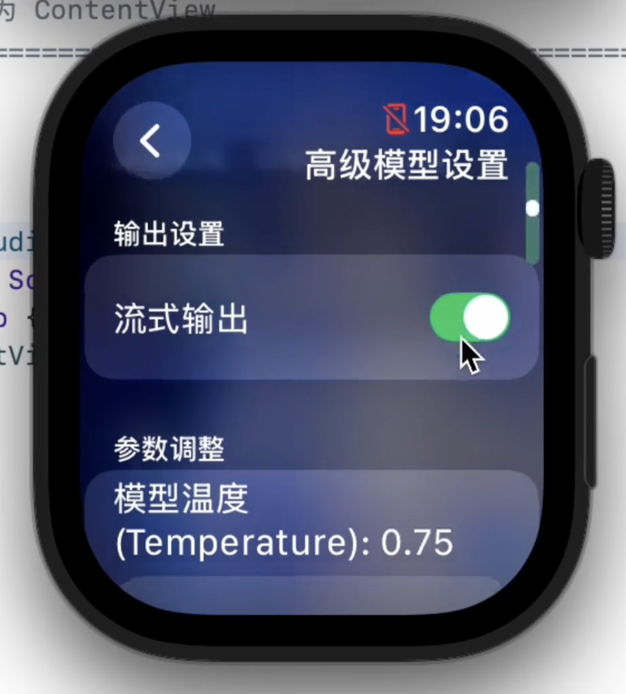

# ETOS LLM Studio - Apple Watch AI 聊天应用

[](https://swift.org)
[](https://developer.apple.com/watchos/)
[](LICENSE)

一个专为 Apple Watch 设计的、功能强大且高度可定制的 AI 聊天应用。

## 🎥 演示视频

<video controls width="300">
  <source src="assets/etos-llm-studio-demo.mp4" type="video/mp4">
  Your browser does not support the video tag.
</video>

## 📸 截图 (Screenshots)

| | |
|:---:|:---:|
|  |  |
|  |  |
|  |  |
|  |  |

---

## 目录
- [🎥 演示视频](#-演示视频)
- [📸 截图 (Screenshots)](#-截图-screenshots)
- [✨ 功能特性](#-功能特性)
- [🛠️ 技术栈](#️-技术栈)
- [🚀 快速开始](#-快速开始)
- [📱 使用说明](#-使用说明)
- [📤 网络导出功能](#-网络导出功能)
- [⚙️ 配置说明](#️-配置说明)
- [🎨 自定义设置](#-自定义设置)
- [✍️ 开发故事与心路历程](#️-开发故事与心路历程)
- [🤝 贡献指南](#-贡献指南)
- [📄 许可证](#-许可证)
- [🙏 致谢](#-致谢)
- [📞 联系信息](#-联系信息)

---

## ✨ 功能特性

<details>
<summary><strong>核心聊天体验</strong></summary>

- 🎯 **Apple Watch 原生应用**: 专为 watchOS 优化，提供流畅、美观的交互体验。
- 🤖 **多模型支持**: 可配置并轻松切换多个 AI 模型，甚至支持同一模型的多个 API Key 轮询。
- 💬 **智能聊天**: 支持上下文对话、流式输出和 AI 思考过程显示。
- 📝 **Markdown 渲染**: 消息支持 Markdown 格式，代码、列表等排版更美观。
- ✏️ **消息编辑功能**: 可以随时编辑已发送的消息或 AI 的回复。
- 🔁 **对话重试功能**: 一键重新生成 AI 的最后一次回复。

</details>

<details>
<summary><strong>强大的会话管理</strong></summary>

- 💾 **多会话管理**: 支持创建、保存和管理多个独立的聊天会话。
- 🌿 **会话分支**: 可以从现有会话的任意节点创建新分支，方便进行对比和探索性提问。
- 📤 **网络导出**: 支持将会话以 JSON 格式通过本地网络导出到电脑，便于存档和分析。
- ⚡ **懒加载机制**: 对话过长时，自动懒加载历史消息，保证应用启动和滚动的流畅性。

</details>

<details>
<summary><strong>高度可定制化</strong></summary>

- 🎨 **个性化主题**: 可自定义聊天背景图片，并调整模糊度、透明度等视觉效果。
- 🔄 **自动背景轮换**: 支持每次启动时随机切换背景图片。
- ⚙️ **高级参数调节**: 支持调节 Temperature、Top P 等核心模型参数。
- 📋 **三层提示词系统**: 通过“全局系统提示词” + “话题提示词” + “增强提示词”的组合，实现对 AI 行为的精细化、分层化控制。

</details>

## 🛠️ 技术栈

- **SwiftUI**: 声明式用户界面框架。
- **MarkdownUI**: 用于在 SwiftUI 中渲染 Markdown 文本的库。
- **URLSession**: 处理与 AI 后端的网络请求，支持标准及流式响应。
- **FileManager**: 在本地文档目录中持久化存储聊天会话和消息。
- **UserDefaults & AppStorage**: 存储用户偏好和应用设置。
- **Codable**: 用于 JSON 数据的序列化和反序列化。
- **Python**: 提供一个简单的配套服务器，用于接收网络导出的数据。

## 🚀 快速开始

### 前提条件

- Xcode 16.4 或更高版本
- watchOS 11.5 或更高版本
- Apple Watch Series 4 或更新型号
- Python 3 (用于配套的导出接收服务器)

### 安装步骤

1.  **克隆项目**
    ```bash
    git clone https://github.com/Eric-Terminal/ETOS-LLM-Studio.git
    cd ETOS-LLM-Studio
    ```

2.  **配置 API 设置**
    在 Xcode 项目中找到并编辑 `ETOS LLM Studio Watch App/AppConfig.json` 文件，配置你的 AI 模型 API。 
    
    **重要**: `apiKeys` 字段现在是一个数组，你可以填入一个或多个 API 密钥。应用会在每次请求时随机选择一个使用，这对于使用多个免费额度或备用密钥非常有用。

    ```json
    {
      "backgrounds": ["Background1", "Background2", "Background3"],
      "models": [
        {
          "name": "你的模型名称",
          "apiKeys": [
            "你的API密钥_1",
            "你的API密钥_2"
          ],
          "apiURL": "API端点URL",
          "basePayload": {
            "model": "模型ID",
            "max_tokens": 4096
          }
        }
      ]
    }
    ```

3.  **添加背景图片**
    本项目使用 Xcode 的资源目录 (Assets.xcassets) 来管理背景图。添加您自己的背景图最简单的方法是：
    1.  在 Xcode 的左侧文件导航器中，找到并点击 `ETOS LLM Studio Watch App` -> `Assets.xcassets`。
    2.  在打开的资源列表中，右键点击空白处，选择 `New Image Set`。
    3.  将这个新创建的 `Image Set` 重命名，使其与您在 `AppConfig.json` 的 `backgroundImages` 数组中定义的名字一致（例如，`Background4`）。
    4.  将您的图片文件（如 `my_background.png`）拖拽到刚刚创建的 Image Set 的 `1x`、`2x` 或 `3x` 空位中。
    5.  重复此步骤以添加更多背景图。

4.  **编译运行**
    在 Xcode 中选择 `ETOS LLM Studio Watch App` 作为目标，连接你的 Apple Watch，然后点击“运行”按钮。

## 📱 使用说明

1.  **开始新对话**: 在设置中点击“开启新对话”。
2.  **切换模型**: 在设置中选择不同的 AI 模型。
3.  **查看历史**: 在设置中进入“历史会话”，可以查看、切换、删除或编辑所有会话。
4.  **消息操作**: 右滑任意一条消息，可以调出“更多”菜单，进行编辑、重试或删除操作。
5.  **显示思考过程**: 在 AI 的回复气泡中，如果包含思考过程，可以点击展开/折叠。
6.  **调节参数**: 在“设置” -> “高级设置”中，可以调节模型参数和三层提示词。
7.  **创建分支**: 在“历史会话”列表中，右滑一个会话，选择“创建分支”。
8.  **导出会话**: 在“历史会话”列表中，右滑一个会话，选择“通过网络导出”。

## 📤 网络导出功能

项目提供了一个 Python 脚本作为本地服务器，用于接收从手表端导出的聊天数据。

#### 使用方法

1.  **启动接收服务器**
    在你的 Mac 终端中，进入项目根目录，运行以下命令：
    ```bash
    python3 local_post_listener.py
    ```

2.  **查看服务器地址**
    服务器启动后，会显示类似如下的信息：
    ```
    ============================================================
    Python POST 监听服务器已准备就绪 
    ============================================================
    服务器正在监听端口: 9000

    请在您的 Apple Watch 应用的导出界面中输入以下地址:
     >>> http://192.168.1.100:9000 <<<

    注意: 请确保您的手表和此电脑连接在同一个Wi-Fi网络下。
    ============================================================
    服务器运行中... 按 Ctrl+C 停止服务。
    ```

3.  **在手表应用中导出**
    - 进入“设置” -> “历史会话”。
    - 右滑你想要导出的会话，选择“更多” -> “通过网络导出”。
    - 在导出界面输入服务器显示的 `IP:Port` 地址。
    - 点击“发送到电脑”。

#### 服务器功能

- ✅ 监听指定的本地端口。
- ✅ 接收 POST 请求并解析 JSON 数据。
- ✅ 在控制台美观地显示接收到的提示词和聊天历史。
- ✅ 自动将接收到的数据保存到带时间戳的 JSON 文件中。
- ✅ 自动检测并显示本机的局域网 IP 地址。

<details>
<summary><strong>配套 Python 接收服务器源码 (local_post_listener.py)</strong></summary>

```python
# ============================================================================ 
# local_post_listener.py
# ============================================================================ 
# 一个简单的HTTP服务器，用于接收来自ETOS LLM Studio Watch App的网络导出数据。
#
# 功能:
# - 监听指定的本地端口。
# - 接收POST请求。
# - 将请求体中的JSON数据解析并打印到控制台。
# - 将接收到的数据保存到一个带时间戳的 .json 文件中。
#
# 使用方法:
# 1. 确保您的电脑安装了 Python 3。
# 2. 在终端中运行此脚本: python3 local_post_listener.py
# 3. 脚本会显示您电脑的局域网IP地址和监听的端口。
# 4. 在手表App的导出界面，输入显示的 IP:Port 地址。
# 5. 点击发送，数据就会被此脚本接收和保存。
# ============================================================================ 

import http.server
import socketserver
import json
import os
import socket
from datetime import datetime

# --- 配置 ---
# 您可以在这里修改服务器监听的端口号
PORT = 9000
# 用于保存接收到的聊天记录的目录名称
SAVE_DIR = "received_chat_logs"

class ChatExportHandler(http.server.SimpleHTTPRequestHandler):
    """
    自定义请求处理器，专门用于处理聊天记录导出的POST请求。
    """
    def do_POST(self):
        """
        处理POST请求的核心方法。
        """
        try:
            # 1. 获取请求头中的内容长度
            content_length = int(self.headers['Content-Length'])
            # 2. 读取请求体数据
            post_data = self.rfile.read(content_length)
            
            print("\n" + "="*60)
            print(f"[{datetime.now().strftime('%Y-%m-%d %H:%M:%S')}] 收到一个新的POST请求")
            print(f"来源 IP: {self.client_address[0]}")
            print("="*60)

            # 3. 解析JSON数据
            data = json.loads(post_data.decode('utf-8'))
            
            # 4. 在控制台以美观的格式打印接收到的数据
            print("✅ 成功解析JSON数据，内容如下:")
            print("-" * 60)
            print(json.dumps(data, indent=4, ensure_ascii=False))
            print("-" * 60)
            
            # 5. 将数据保存到文件
            self.save_to_file(data)

            # 6. 向客户端发送成功的响应
            self.send_response(200)
            self.send_header('Content-type', 'text/plain; charset=utf-8')
            self.end_headers()
            self.wfile.write("✅ 数据接收并保存成功。".encode('utf-8'))
            print("\n[状态] 已成功处理请求并向客户端返回成功信息。")

        except json.JSONDecodeError:
            print("\n❌ 错误: 无法解析接收到的数据为JSON格式。")
            self.send_error(400, "请求体不是有效的JSON格式。")
        except Exception as e:
            print(f"\n❌ 发生未知错误: {e}")
            self.send_error(500, f"服务器内部错误: {e}")

    def save_to_file(self, data):
        """
        将接收到的字典数据保存为格式化的JSON文件。
        """
        try:
            # 确保保存目录存在，如果不存在则创建
            if not os.path.exists(SAVE_DIR):
                os.makedirs(SAVE_DIR)
                print(f"[信息] 已创建新目录用于保存文件: '{SAVE_DIR}'")

            # 使用当前时间生成一个唯一的文件名
            timestamp = datetime.now().strftime("%Y%m%d_%H%M%S_%f")
            filename = f"chat_session_{timestamp}.json"
            filepath = os.path.join(SAVE_DIR, filename)

            # 将数据写入文件
            with open(filepath, 'w', encoding='utf-8') as f:
                json.dump(data, f, indent=4, ensure_ascii=False)
            print(f"✅ 数据已成功保存到文件: {filepath}")
        except Exception as e:
            print(f"❌ 错误: 保存文件失败 - {e}")
            # 即使保存失败，也应通知用户，但服务器仍可认为请求已处理
            # 可以在这里添加更复杂的错误处理逻辑

def get_local_ip():
    """
    获取本机的局域网IP地址。
    """
    try:
        # 创建一个socket对象
        s = socket.socket(socket.AF_INET, socket.SOCK_DGRAM)
        # 连接到一个公共DNS服务器（此操作不会真的发送数据）
        s.connect(("8.8.8.8", 80))
        # 获取套接字的本地地址
        ip_address = s.getsockname()[0]
        s.close()
        return ip_address
    except Exception:
        print("\n⚠️  警告: 无法自动检测您的局域网IP地址。")
        print("   将使用 '127.0.0.1' 作为备用地址。")
        print("   如果您的手表和电脑在同一网络下，请手动查找您电脑的IP地址")
        print("   (例如，在 macOS 的 '系统设置' -> '网络' 中查看)。")
        return '127.0.0.1'

def run_server():
    """
    启动HTTP服务器。
    """
    with socketserver.TCPServer(('', PORT), ChatExportHandler) as httpd:
        ip_address = get_local_ip()
        
        print("="*60)
        print(" Python POST 监听服务器已准备就绪 ")
        print("="*60)
        print(f"服务器正在监听端口: {PORT}")
        print("\n请在您的 Apple Watch 应用的导出界面中输入以下地址:")
        print(f" >>> http://{ip_address}:{PORT} <<<")
        print("\n注意: 请确保您的手表和此电脑连接在同一个Wi-Fi网络下。")
        print("="*60)
        print("服务器运行中... 按 Ctrl+C 停止服务。")
        
        httpd.serve_forever()

if __name__ == "__main__":
    run_server()
```
</details>

#### 保存的文件格式

导出的数据包含完整的提示词和聊天历史：
```json
{
  "prompts": {
    "globalSystemPrompt": "这是全局系统提示词 (如果设置了)",
    "topicPrompt": "这是当前话题的提示词 (如果设置了)", 
    "enhancedPrompt": "这是增强提示词 (如果设置了)"
  },
  "history": [
    {
      "role": "user",
      "content": "用户发出的第一条消息。",
      "reasoning": null
    },
    {
      "role": "assistant",
      "content": "AI 的回复内容。",
      "reasoning": "AI 的思考过程 (如果存在)。"
    }
  ]
}
```

## ⚙️ 配置说明

### AppConfig.json 结构

应用的所有关键配置都集中在 `AppConfig.json` 文件中。

```json
{
  "backgrounds": ["Background1", "Background2", "Background3"],
  "models": [
    {
      "name": "模型显示名称",
      "apiKeys": ["密钥1", "密钥2"],
      "apiURL": "API端点URL",
      "basePayload": {
        "model": "模型ID",
        "max_tokens": 4096
      }
    }
  ]
}
```

### API 响应格式

应用兼容标准的 OpenAI API 格式。对于流式响应，它会解析 `delta` 字段；对于标准响应，它会解析 `message` 字段。同时，为了支持“思考过程”显示，应用会额外查找 `reasoning_content` 字段。

**标准响应示例:** 
```json
{
  "choices": [
    {
      "message": {
        "content": "这是AI的回复内容。",
        "reasoning_content": "这是AI的思考过程，可以为空。"
      }
    }
  ]
}
```

**流式响应 `data` 块示例:** 
```json
{
  "choices": [
    {
      "delta": {
        "content": "部分回复内容",
        "reasoning_content": "部分思考过程内容"
      }
    }
  ]
}
```

## 🎨 自定义设置

- **背景图片**: 支持自定义背景图片，可设置自动轮换或手动选择。
- **视觉效果**: 可调整背景图片的模糊度 (0-25) 和透明度 (0.1-1.0)。
- **显示选项**: 启用/禁用 Markdown 渲染。
- **模型参数**: 支持调节 Temperature (0.0-2.0) 和 Top P (0.0-1.0)。
- **提示词系统**:
  - **全局系统提示词**：应用级别的通用指令，对所有会话生效。
  - **话题提示词**：针对特定会话的定制指令，仅对当前会话生效。
  - **增强提示词**：附加在用户最新一条消息末尾的指令，用于临时增强或改变AI行为。
- **上下文管理**: 设置发送到模型的最近消息数量（0为不限制）。
- **性能设置**: 设置懒加载的消息数量，优化长对话性能（0为不限制）。

## ✍️ 开发故事与心路历程

### 为什么会有这个项目？
在学校的日子挺无聊的，平时又有很多问题想问问 AI。我翻遍了 App Store，发现 Apple Watch 上能用的 AI 应用，要么贵得离谱，要么做得太傻，没一个顺手的。
于是我寻思：要不...自己写一个？
结果，就真给搓出来了。
现在，我决定把它开源分享出来。

### 给想用的朋友（勇士）们
如果你也想在自己的 Apple Watch 上用这个 App，我得先给你泼盆冷水：这玩意儿折腾起来，可能有点遗憾。
它注定是一个小众的玩具，因为你需要：
*   一台 Mac（或者折腾个黑苹果/虚拟机）。
*   安装几十个 G 的 Xcode，以及同样巨大的 iOS 和 watchOS 开发套件。
*   把这个项目从 GitHub 上 clone 下来。
*   用自己的 Apple ID 把它“旁加载”到你的手表上。
*   最刺激的是，这个 App 只有 7 天的“保质期”，你得每周像刷打周本一样，重新连接电脑构建一次给它“续命”。

### 一些想说的话
“你为啥不上架 App Store？”
问得好！我也想啊！但苹果开发者计划那 99 美元一年的“门票”，对我一个高二学生来说，实在是买不起。
说个好玩的，我还是个业余无线电爱好者，前段时间刚咬牙买了个车载电台，结果现在连买 13.8V 电源和天线的钱都没了... 你就知道我有多穷了😂。
所以，这个项目的一切都主打一个“怎么便宜怎么来”：
*   **API Key**：除了白嫖英伟达和谷歌的免费额度，剩下的硅基流动也都是我辛辛苦苦刷来的赠金。
*   **配置方式**：因为纯自用，所有的 API Key 和模型参数，我都简单粗暴地写在了 AppConfig.json 配置文件里，直接编译进去。
这也导致了这东西“不通用”，别人想用的话，就得自己动手改配置、重新编译，门槛相当高。

### 关于未来
如果以后我“暴富”了，或者有好心人愿意捐赠，凑够了那 99 美元，我非常乐意把它上架！
到那时，我会在 iPhone 上开发一个配套 App，让大家可以直接在手机上舒舒服服地输入和修改 API Key，再也不用这么折腾了。

### 最后的感谢 
必须得感谢苹果！Swift 语言和 SwiftUI 框架真的太神奇了，居然能让我这么一个 watchOS 新手，在这么短的时间里，写出这么好看、这么流畅的页面。
至少现在，我自己用起来是挺舒服的。
希望你也能喜欢。

---

## 🤝 贡献指南

欢迎提交 Issue 和 Pull Request！

1.  Fork 本项目
2.  创建特性分支 (`git checkout -b feature/AmazingFeature`)
3.  提交更改 (`git commit -m 'Add some AmazingFeature'`)
4.  推送到分支 (`git push origin feature/AmazingFeature`)
5.  开启 Pull Request

## 📄 许可证

本项目采用 MIT 许可证 - 查看 [LICENSE.txt](LICENSE.txt) 文件了解详情。

## 🙏 致谢

- [Swift Markdown UI](https://github.com/gonzalezreal/swift-markdown-ui) - 优秀的 Markdown 渲染库。
- Apple Developer Documentation - 提供了丰富的开发资源。

## 📞 联系信息

- **开发者**: Eric-Terminal
- **GitHub**: [https://github.com/Eric-Terminal](https://github.com/Eric-Terminal)
- **邮箱**: [eric-terminal@qq.com]

---
⭐ 如果这个项目对你有帮助，请给它一个 Star！
