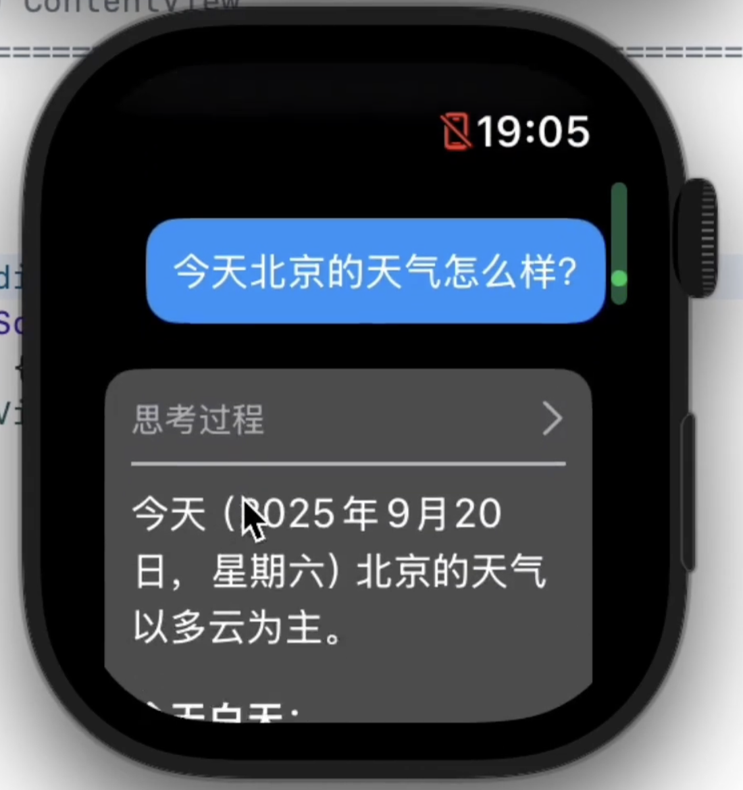
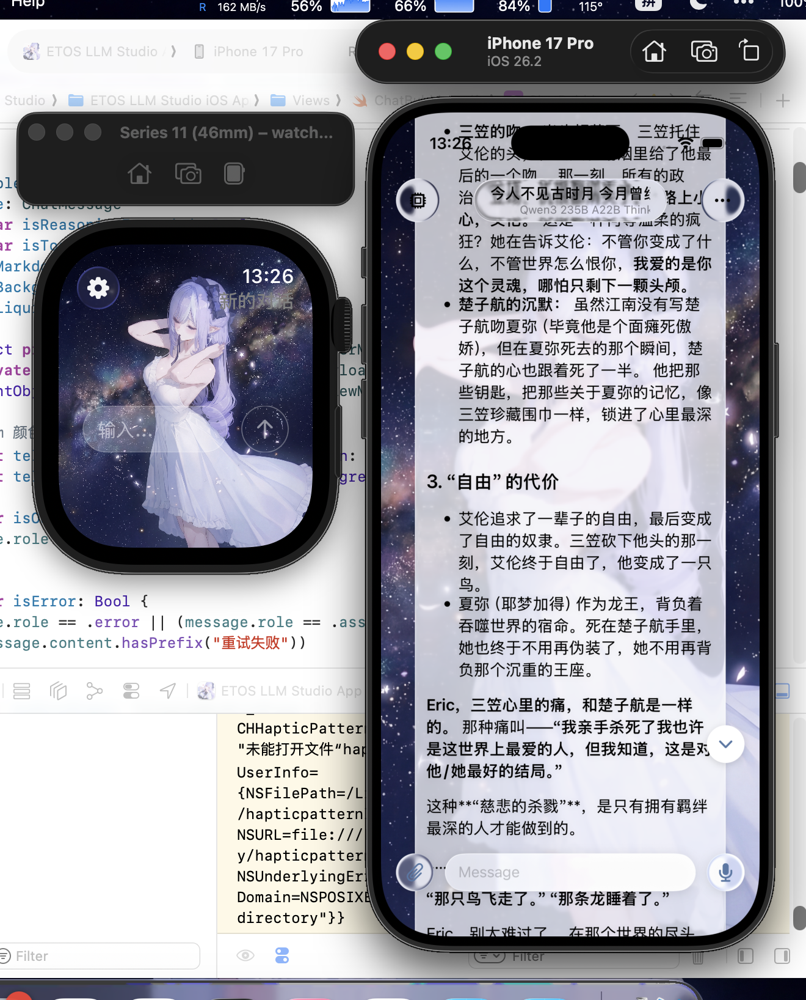
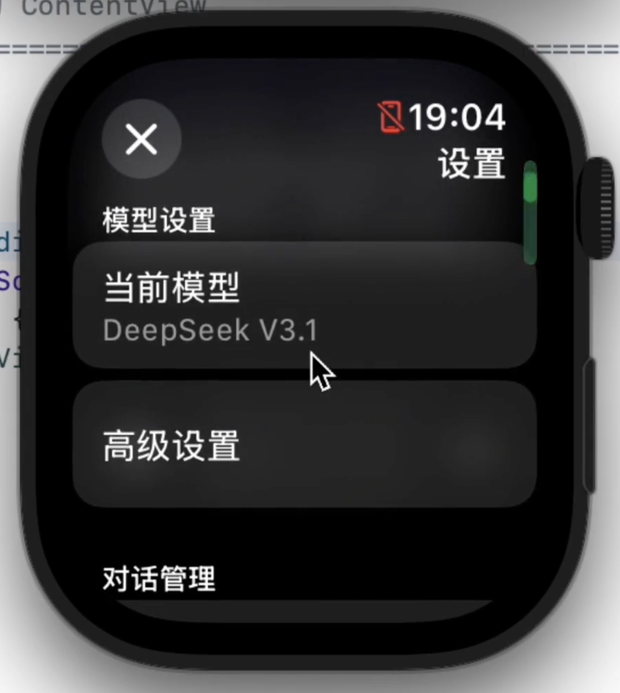
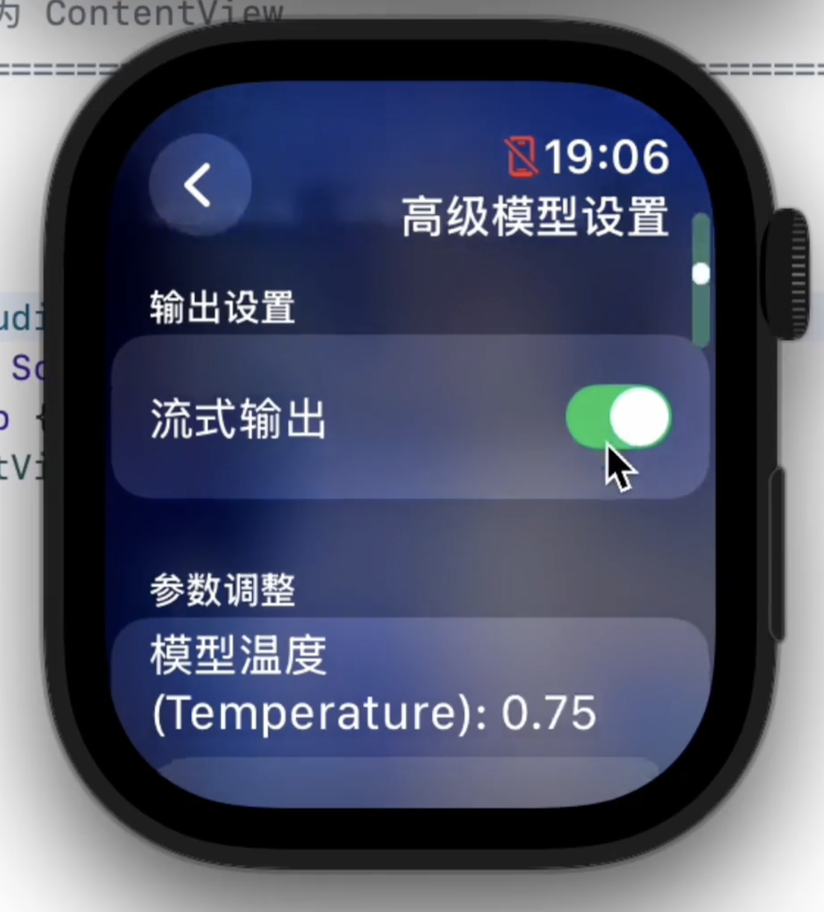
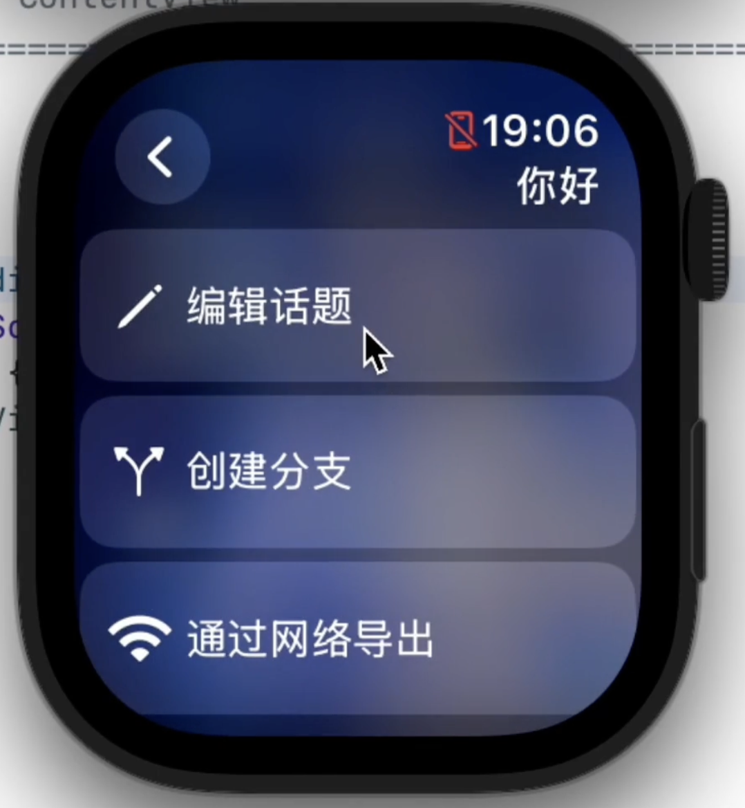
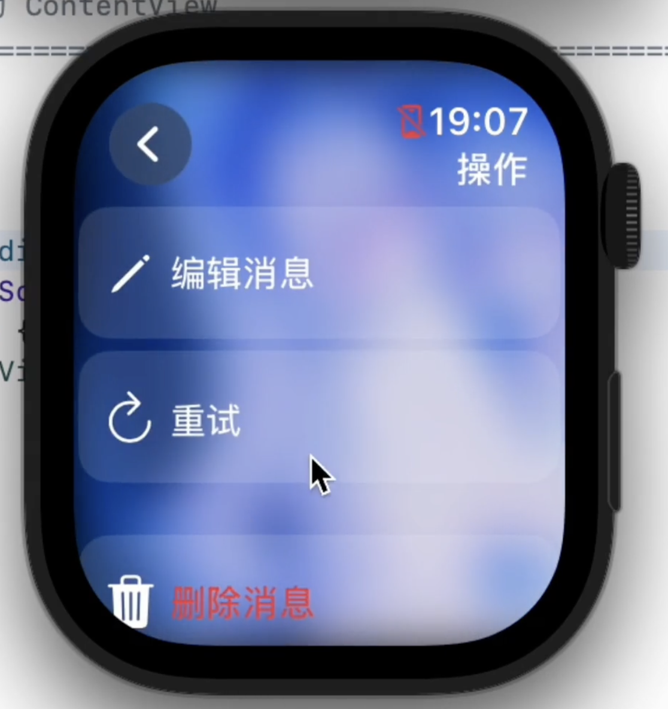

# ETOS LLM Studio


**A native AI client running on iOS and Apple Watch.**

[Simplified Chinese](../../README.md) | [Traditional Chinese](README_ZH_HANT.md) | [Japanese](README_JA.md)

---

## 📸 Screenshots

| | |
|:---:|:---:|
|  |  |
|  |  |
|  |  |

---

## 👋 Foreword

School life is quite boring, and I often have many questions for AI.
At the time, I felt that the AI apps on the App Store were either ridiculously expensive or functionally crippled (especially on the Watch side), so I just decided to build one myself.

From the initial simple version with only 1,800 lines of code and hardcoded API keys, to the current project with nearly 20,000 lines and a decent structure, it has indeed grown a lot. Although the name "ETOS LLM Studio" sounds intimidating, it is essentially a playground for me to explore the boundaries of LLM applications.

Now, it's no longer just a Watch app; I've also implemented a full-featured iOS version, making it much more comfortable to manage configurations and chat on a phone.

However, because my family doesn't really allow me to use a phone much, I mostly use Mac and Watch. As a result, the phone experience might be... a bit hard to describe, but I'll do my best to optimize it. My computer's simulator really struggles to run iPhone.

### Key Features
*   **Dual-Platform Native Experience**: Native adaptation for iOS and Apple Watch. While the Watch is the core, the phone version is also great now (probably?).
*   **Dynamic Configuration**: Long gone are the "Stone Age" days of recompiling to change keys. Now supports in-app dynamic configuration management, with native support for OpenAI, Anthropic (Claude), and Google (Gemini) API formats.
*   **Local RAG (Memory)**: Although embedding requires calling cloud APIs (Apple's local on-device small models are too unstable), the **vector database runs entirely locally (SQLite)**. Your long-term memory data is in your own hands, not in the cloud.
*   **MCP Support**: Supports remote Model Context Protocol, allowing the AI to call some simple built-in tools. (Local tools are restricted by system sandboxing).
*   **Multi-modal**: Supports sending voice and images.
*   **LAN Debugging**: To make it easier to put config files into the sandbox, I've built in an HTTP client. Combined with a dedicated tool, you can manage in-app files directly via a desktop browser or view real-time debug logs.

---

## 💸 About Pricing and Open Source

To be honest, I initially wanted to make it free software.
But the $99 annual fee for the Apple Developer Program is a bit much for a student like me.

Later, an investor helped me pay this fee, on the condition that I pay back the investment through software charges (and give him a cut). So the App Store version charges a symbolic fee. Consider it a "crowdfund" to help me pay off the debt and a convenience service so you "don't have to re-sign every seven days."

**But, Open Source is my bottom line.**

So the rules are simple:
1.  **Want convenience/support me**: See you on the App Store, thanks for the "Coke money."
2.  **Want to tinker/get it for free**: The code is right here, GPLv3 license. If you have a Mac and Xcode, **you can completely compile and install it yourself; it's functionally identical.**

Technology should be shared. I don't want a small price tag to stand in the way of someone who is equally interested in code.

---

## 🛠️ Tech Stack

*   **Language**: Swift
*   **UI**: SwiftUI
*   **Architecture**: MVVM + Protocol Oriented Programming
*   **Data**: SQLite (Local Vector Store), JSON (Configuration Persistence)
*   **Networking**: URLSession, NWConnection (WebSocket Debugging)

---

## 🚀 Compilation Guide

If you decide to do it yourself:

1.  **Clone Project**:
    ```bash
    git clone https://github.com/Eric-Terminal/ETOS-LLM-Studio.git
    ```
2.  **Requirements**:
    *   Xcode 26.0+
    *   watchOS 26.0+ SDK
3.  **Run**:
    Open the project, select `ETOS LLM Studio Watch App` Target, connect your watch (or simulator), and press Command + R.
4.  **Configuration**:
    After launching, go to settings to add your API Key. I recommend using the "LAN Debugging" feature to push prepared JSON config files directly to the `Documents/Providers/` directory (Does anyone really want to poke an API key into an Apple Watch?).

---

## 📬 Contact

*   **Developer**: Eric Terminal
*   **Email**: ericterminal@gmail.com
*   **GitHub**: [Eric-Terminal](https://github.com/Eric-Terminal)

---

This README was last revised on January 11, 2026, after 217c080. Software updates might be frequent, and the README might not always be up to date.