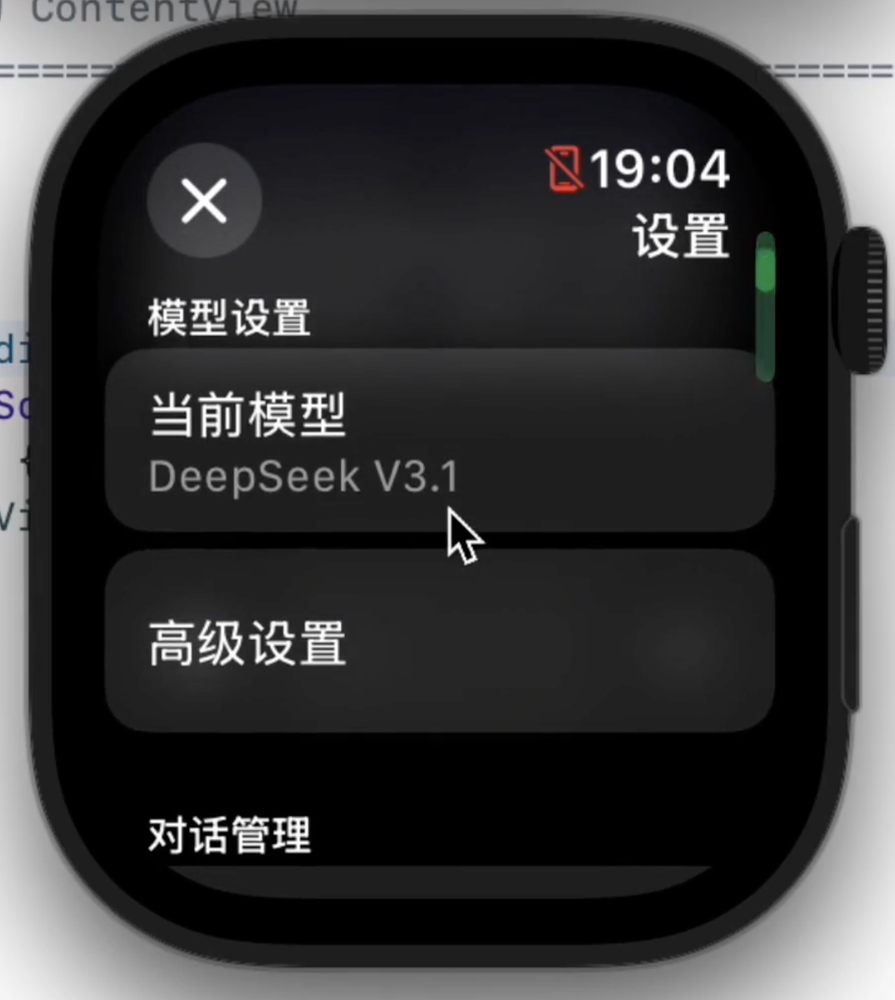
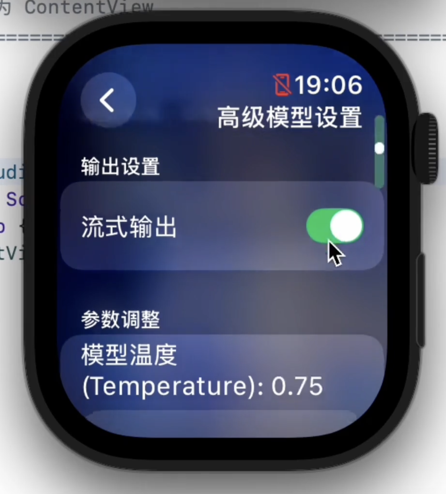
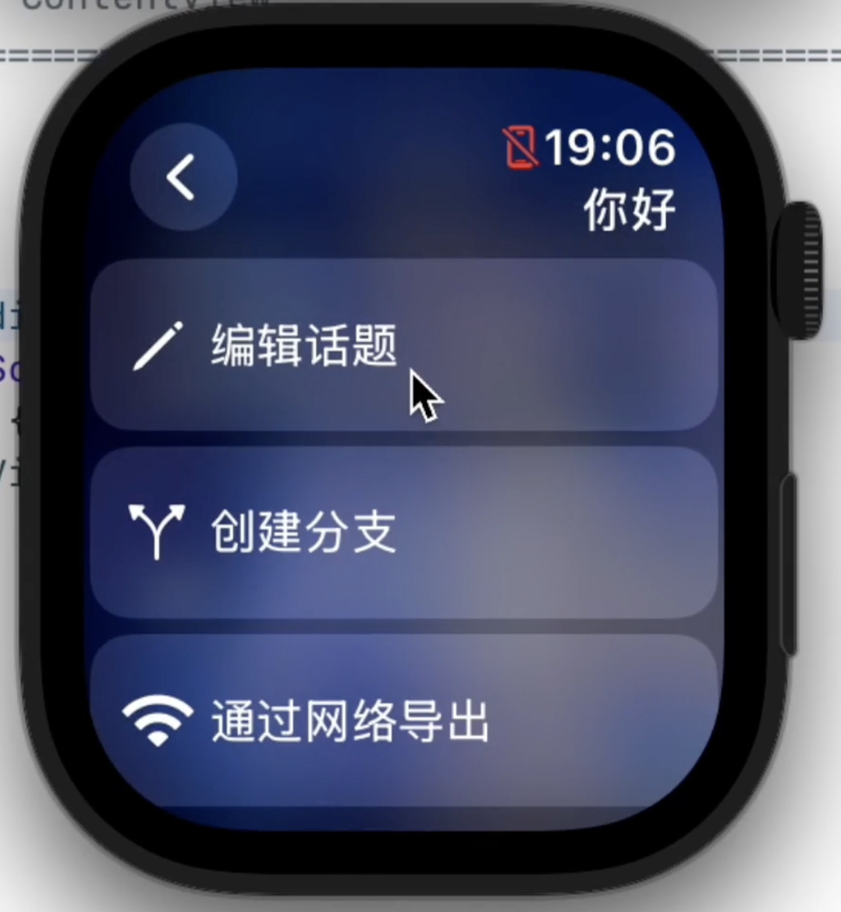
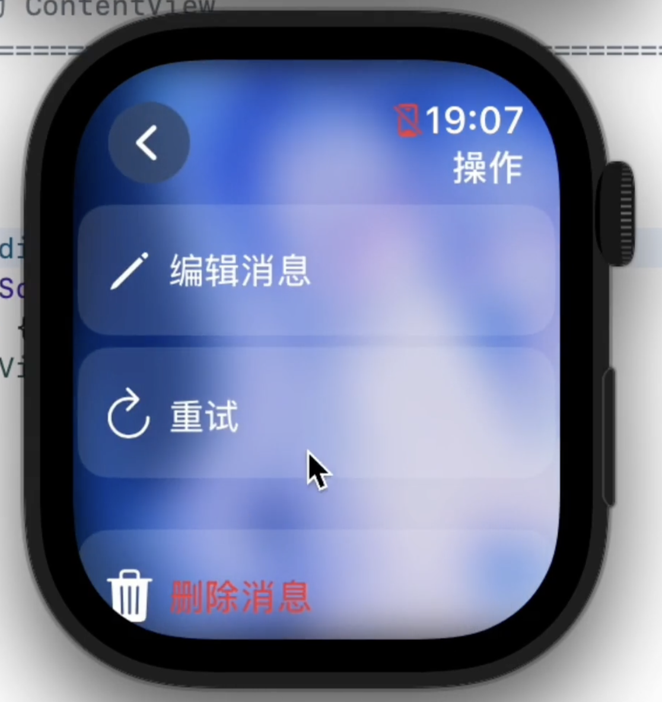

# ETOS LLM Studio


**A native AI client for iOS and Apple Watch. Supports OpenAI, Anthropic Claude, Google Gemini, local RAG memory, MCP tool calling, Worldbook, and Siri Shortcuts.**

[Simplified Chinese](../../README.md) | [Traditional Chinese](README_ZH_HANT.md) | [Japanese](README_JA.md)

---

## 📸 Screenshots

| | |
|:---:|:---:|
|  |  |
|  |  |
|  |  |

---

## 👋 Foreword

School life is quite boring, and I often have many questions for AI.
At the time, I felt that the AI apps on the App Store were either ridiculously expensive or functionally crippled (especially on the Watch side), so I just decided to build one myself.

From the initial simple version with only 1,800 lines of code and hardcoded API keys, to the current project with 155 Swift source files and over 73,000 lines (including Shared/iOS/watchOS and test code), it has indeed grown a lot. Although the name "ETOS LLM Studio" sounds intimidating, it is essentially a playground for me to explore the boundaries of LLM applications.

Now, it's no longer just a Watch app; I've also implemented a full-featured iOS version, making it much more comfortable to manage configurations and chat on a phone.

However, because my family doesn't really allow me to use a phone much, I mostly use Mac and Watch. As a result, the phone experience might be... a bit hard to describe, but I'll do my best to optimize it. My computer's simulator really struggles to run iPhone.

### Key Features
*   **Dual-Platform Native Experience**: Native adaptation for iOS and Apple Watch, with platform-specific optimization for each screen size.
*   **Multi-Model Support**: Native adapters for OpenAI, Anthropic (Claude), and Google (Gemini), with provider/model management plus custom headers, parameter expressions, and raw JSON request body mode.
*   **Tool Center + Extended Tools**: Unified management for MCP / Shortcuts / local tools, with enable toggles, approval strategy, session-level configuration, and sandbox file tools (search, chunked read, diff, partial edit, move/copy/delete).
*   **Local RAG (Memory)**: Embeddings can use cloud APIs, but the **vector database is fully local (SQLite)**. Also supports chunking, embedding progress, memory editing, and active memory retrieval tools.
*   **MCP Integration**: Remote [Model Context Protocol](https://modelcontextprotocol.io) support with streamable HTTP/SSE transport, server management, and more complete protocol compatibility (reconnect, timeout, handshake, capability negotiation).
*   **Worldbook**: Lorebook-like system with conditional triggers, session-bound isolation mode, system-message injection, URL import, and compatibility with PNG naidata / top-level JSON array / character_book.
*   **Request Logs and Speed Insights**: Independent request logs, detailed token summaries, and streaming response speed charts.
*   **Storage Management Upgrade**: Built-in file manager for browsing and managing sandbox files in-app.
*   **Siri Shortcuts**: Integrated with Shortcuts framework, including custom tools and URL scheme routing.
*   **In-App Feedback Assistant**: Feedback categories, environment collection, PoW submission chain, and cross-device sync.
*   **Multi-modal**: Supports voice and image input, plus AI image generation.
*   **Cross-Device Sync**: Built-in iOS ↔ watchOS sync engine for providers, sessions, worldbook, and tool configurations.
*   **Advanced Rendering**: Built-in Markdown renderer with syntax highlighting, tables, and LaTeX formulas.
*   **LAN Debugging**: Built-in HTTP client for browser-based in-app file management and real-time debug logs.
*   **Localization**: English, Simplified Chinese, Traditional Chinese (HK), and Japanese.

---

## 💸 About Pricing and Open Source

To be honest, I initially wanted to make it free software.
But the $99 annual fee for the Apple Developer Program is a bit much for a student like me.

Later, an investor helped me pay this fee, on the condition that I pay back the investment through software charges (and give him a cut). So the App Store version charges a symbolic fee. Consider it a "crowdfund" to help me pay off the debt and a convenience service so you "don't have to re-sign every seven days."

**But, Open Source is my bottom line.**

So the rules are simple:
1.  **Want convenience/support me**: See you on the App Store, thanks for the "Coke money."
2.  **Want to tinker/get it for free**: The code is right here, GPLv3 license. If you have a Mac and Xcode, **you can completely compile and install it yourself; it's functionally identical.**

Technology should be shared. I don't want a small price tag to stand in the way of someone who is equally interested in code.

---

## 🛠️ Tech Stack

*   **Language**: Swift 6
*   **UI**: SwiftUI
*   **Architecture**: MVVM + Protocol Oriented Programming
*   **Data**: SQLite (Local Vector Store), JSON (Configuration Persistence)
*   **Networking**: URLSession (API requests), Streamable HTTP/SSE (MCP transport)
*   **AI Protocol**: Model Context Protocol (MCP)
*   **Integrations**: Siri Shortcuts, WatchConnectivity (cross-device sync)
*   **Dependency Management**: Swift Package Manager (currently `swift-markdown-ui`, with transitive dependencies `networkimage` and `swift-cmark`)

---

## 🚀 Compilation Guide

If you decide to do it yourself:

1.  **Clone Project**:
    ```bash
    git clone https://github.com/Eric-Terminal/ETOS-LLM-Studio.git
    ```
2.  **Requirements**:
    *   Xcode 26.0+
    *   watchOS 26.0+ SDK
3.  **Open Project**:
    Open `ETOS LLM Studio.xcworkspace` (**workspace**, not xcodeproj).
    On first launch, Xcode will resolve and fetch Swift Package dependencies automatically.
4.  **Run**:
    Select `ETOS LLM Studio Watch App` or `ETOS LLM Studio iOS App` target, connect your device (or simulator), and press Command + R.
5.  **Configuration**:
    After launching, go to settings to add your API Key. I recommend using the "LAN Debugging" feature to push prepared JSON config files directly to the `Documents/Providers/` directory (Does anyone really want to poke an API key into an Apple Watch?).

---

## 📬 Contact

*   **Developer**: Eric Terminal
*   **Email**: ericterminal@gmail.com
*   **GitHub**: [Eric-Terminal](https://github.com/Eric-Terminal)

---

This README was last revised on March 7, 2026, after 7907e83. Software updates may be frequent, and the README might not always stay up to date.
