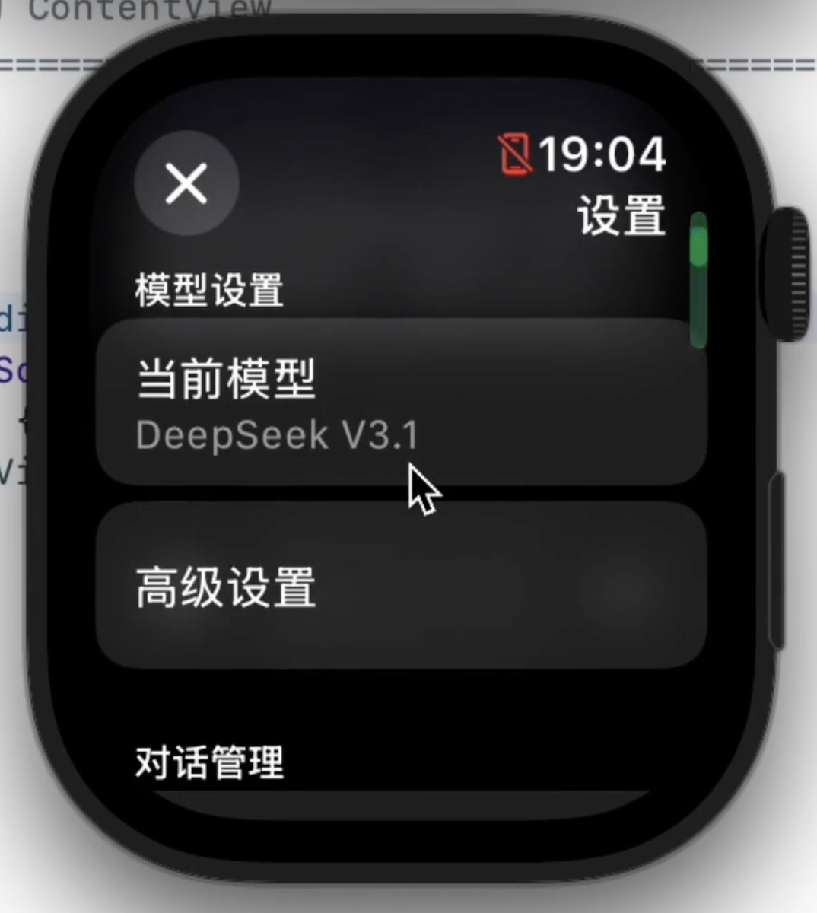

# ETOS LLM Studio


**iOS と Apple Watch で動作するネイティブ AI クライアント。**

[簡體中文](../../README.md) | [English](README_EN.md) | [Traditional Chinese](README_ZH_HANT.md)

---

## 📸 スクリーンショット

| | |
|:---:|:---:|
|  |  |
|  |  |
|  |  |

---

## 👋 はじめに

学校生活は結構退屈で、普段から AI に聞きたいことがたくさんありました。
当時、App Store にある AI アプリは、値段が異常に高いか、機能が制限されすぎている（特に Watch 側）かのどちらかだったので、いっそ自分で作ってしまおうと思いました。

最初はわずか 1,800 行のコードで API Key もハードコーディングしていた粗末なバージョンでしたが、今では 20,000 行近くになり、構造もそれなりにまともなプロジェクトへと成長しました。"ETOS LLM Studio" という名前は少し大げさに聞こえるかもしれませんが、本質的には私が大規模言語モデル（LLM）アプリの可能性を探求するための実験場です。

現在では単なる Watch アプリにとどまらず、iOS 版のフル機能バージョンも実装しました。これでスマホでの設定管理やチャットもずっと快適になるはずです。

ただ、家族の方針であまりスマホを使わせてもらえないため、私は主に Mac と Watch を使用しています。その結果、スマホでの体験は……少し言いにくい部分があるかもしれませんが、できる限り最適化していくつもりです。私のコンピュータのシミュレータで iPhone を動かすのは本当に重いんです。

### 主な機能
*   **デュアルプラットフォーム・ネイティブ体験**：iOS と Apple Watch にネイティブ対応。Watch 版がコアですが、スマホ版も今は同じくらい使いやすい（はず？）です。
*   **動的設定**：Key を変更するために再コンパイルが必要だった「石器時代」とはおさらばです。現在はアプリ内で動的に設定を管理でき、OpenAI、Anthropic (Claude)、Google (Gemini) の API フォーマットにネイティブ対応しています。
*   **ローカル RAG (記憶)**：Embedding にはクラウド API を呼び出す必要がありますが（Apple 独自のローカル小規模モデルは不安定すぎるため）、**ベクトルデータベースは完全にローカル (SQLite) で動作します**。長期記憶データはクラウドではなく、あなたの手の中にあります。
*   **MCP サポート**：リモート Model Context Protocol をサポートしており、AI がいくつかのシンプルな組み込みツールを呼び出すことができます。（ローカルツールはシステムのサンドボックス制限のため実装できません）。
*   **マルチモーダル**：音声と画像の送信をサポートしています。
*   **LAN デバッグ**：設定ファイルをサンドボックスに入れやすくするために、HTTP クライアントを内蔵しました。専用プログラムと組み合わせることで、PC のブラウザからアプリ内のファイルを直接管理したり、リアルタイムのデバッグログを確認したりできます。

---

## 💸 料金とオープンソースについて

正直なところ、最初は無料ソフトにするつもりでした。
しかし、Apple Developer Program の年間 99 ドルという費用は、学生の私にとっては少し厳しいものでした。

その後、ある投資家の方がこの費用を立て替えてくれましたが、その代償として、ソフトウェアの収益でこの投資を返済（さらに利益分配も）することになりました。そのため、App Store 版では象徴的な料金をいただいています。これは借金返済のための「クラウドファンディング」であり、同時に「7日ごとの再署名が不要になる」便利サービスを買うものだと思っていただければ幸いです。

**しかし、オープンソースは私の譲れない一線です。**

現在のルールはシンプルです：
1.  **手間を省きたい/応援したい**：App Store でお会いしましょう。「コーラ代」をありがとうございます。
2.  **いじくり回したい/無料で使いたい**：コードはここにあります。GPLv3 ライセンスです。Mac と Xcode をお持ちなら、**完全に自分でコンパイルしてインストールできます。機能に違いは一切ありません**。

技術は共有されるべきです。数千円程度の壁が、同じようにコードに興味を持つあなたの邪魔をすることがあってはならないと思っています。

---

## 🛠️ 技術スタック

*   **言語**: Swift
*   **UI**: SwiftUI
*   **アーキテクチャ**: MVVM + Protocol Oriented Programming
*   **データ**: SQLite (ローカルベクトルストア), JSON (設定の永続化)
*   **ネットワーク**: URLSession, NWConnection (WebSocket デバッグ)

---

## 🚀 コンパイルガイド

自分でビルドする場合：

1.  **プロジェクトを Clone**:
    ```bash
    git clone https://github.com/Eric-Terminal/ETOS-LLM-Studio.git
    ```
2.  **環境要件**:
    *   Xcode 26.0+
    *   watchOS 26.0+ SDK
3.  **実行**:
    プロジェクトを開き、`ETOS LLM Studio Watch App` ターゲットを選択し、ウォッチ（またはシミュレータ）を接続して Command + R を押します。
4.  **設定**:
    起動後、設定画面で API Key を追加してください。「LAN デバッグ」機能を使用して、作成した JSON 設定ファイルを `Documents/Providers/` ディレクトリに直接プッシュすることをお勧めします（Apple Watch の画面で API Key をポチポチ入力したい人なんていますか？）。

---

## 📬 連絡先

*   **開発者**: Eric Terminal
*   **Email**: ericterminal@gmail.com
*   **GitHub**: [Eric-Terminal](https://github.com/Eric-Terminal)

---

この README は 2026年1月11日、217c080 の時点で改訂されました。ソフトウェアの更新は頻繁に行われる可能性があり、README が常に最新であるとは限りません。
