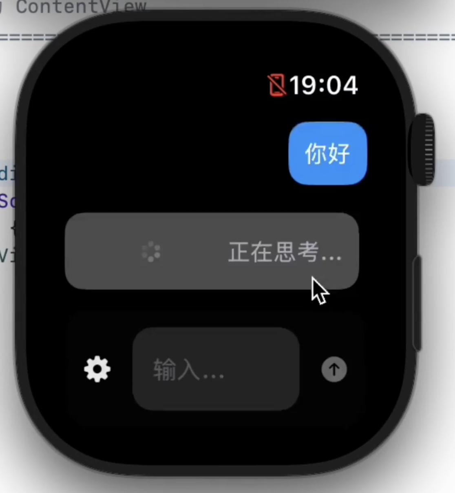

# ETOS LLM Studio


**一個運行在 iOS 和 Apple Watch 上的原生 AI 客戶端。**

[簡體中文](../../README.md) | [English](README_EN.md) | [Japanese](README_JA.md)

---

## 📸 截圖

| | |
|:---:|:---:|
|  |  |
|  |  |
|  |  |

---

## 👋 寫在前面

在學校的日子挺無聊的，平時又有很多問題想問問 AI。
當時嫌 App Store 上的 AI 應用要麼貴得離譜，要麼功能太殘廢（尤其是手錶端），索性就自己動手搓了一個。

從最初那個只有 1,800 行代碼、API Key 還要硬編碼的簡陋版本，到現在快 20,000 行代碼、結構稍微像樣點的工程，它確實成長了不少。雖然名字叫 "ETOS LLM Studio" 聽著挺唬人，但它本質上就是我探索大模型應用邊界的一個試驗場。

現在，它已經不再僅僅是一個手錶端的 App，我也順手把 iOS 端的全功能版本也給做上了，這樣在手機上管理配置和聊天也會舒服得多。

不過因為我家人不太允許我使用手機的問題，我一般只用 Mac 和 Watch，導致手機。。。可能體驗有點一言難盡，但我會盡力優化的，我的電腦模擬器跑 iPhone 真的很吃力。

### 主要功能
*   **雙端原生體驗**：iOS 和 Apple Watch 原生適配。雖然手錶端是核心，但手機端現在也同樣好用(吧？)。
*   **動態配置**：早已告別了改 Key 要重新編譯的石器時代。現在支持在 App 內動態管理配置，原生適配了 OpenAI、Anthropic (Claude) 和 Google (Gemini) 的 API 格式。
*   **本地 RAG (記憶)**：雖然 Embedding 需要調用雲端 API (Apple 本地的端側小模型太顛了)，但**向量數據庫是完全運行在本地的 (SQLite)**。你的長期記憶數據掌握在自己手中，而不是在雲端。
*   **MCP 支持**：支持遠程 Model Context Protocol，AI 可以調用一些簡單的內置工具。本地因為系統的沙盒限制做不到。
*   **多模態**：支持發送語音和圖片。
*   **局域網調試**：為了方便把配置文件塞進沙盒，我內置了一個 HTTP 客戶端。配合專用程序，你可以在電腦瀏覽器裡直接管理應用內的文件，或者查看實時調試日誌。

---

## 💸 關於收費與開源

說實話，我最開始是想做免費軟件的。
但 Apple Developer Program 每年 $99 的費用，對我一個學生來說確實有點吃力。

後來有位投資員幫我墊付了這筆錢，代價是我需要通過軟件收費來償還這筆投資（而且還要分成給他）。所以 App Store 版本象徵性地收了一點費用，這就當是大家眾籌幫我還債，順便買個「不用每七天重簽一次」的便利服務。

**但是，開源是我的底線。**

所以現在的規則很簡單：
1.  **想省事/支持我**：App Store 見，感謝你的「可樂錢」。
2.  **想折騰/白嫖**：代碼就在這兒，GPLv3 協議。如果你有 Mac 和 Xcode，**完全可以自己編譯安裝，功能上沒有任何區別**。

技術本該共享，我不希望因為幾十塊錢的門檻，擋住了同樣對代碼感興趣的你。

---

## 🛠️ 技術棧

*   **語言**: Swift
*   **UI**: SwiftUI
*   **架構**: MVVM + Protocol Oriented Programming
*   **數據**: SQLite (本地向量庫), JSON (配置持久化)
*   **網絡**: URLSession, NWConnection (WebSocket 調試)

---

## 🚀 編譯指南

如果你決定自己動手：

1.  **Clone 項目**:
    ```bash
    git clone https://github.com/Eric-Terminal/ETOS-LLM-Studio.git
    ```
2.  **環境要求**:
    *   Xcode 26.0+
    *   watchOS 26.0+ SDK
3.  **運行**:
    打開項目，選擇 `ETOS LLM Studio Watch App` Target，連上手錶（或模擬器），Command + R 即可。
4.  **配置**:
    啟動後，去設置裡添加你的 API Key。推薦使用「局域網調試」功能，直接把做好的 JSON 配置文件推送到 `Documents/Providers/` 目錄下 (真的有人會想在 Apple Watch 上面戳 API key 進去嗎)。

---

## 📬 聯繫方式

*   **開發者**: Eric Terminal
*   **Email**: ericterminal@gmail.com
*   **GitHub**: [Eric-Terminal](https://github.com/Eric-Terminal)

---

本次 README 修訂於 2026 年 1 月 11 日，217c080 之後，軟件更新可能很勤快 README 可能更新不及時
