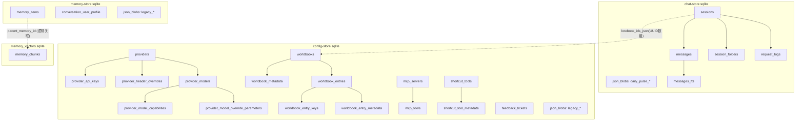

# ETOS LLM Studio 数据库结构深度审计（临时版）

> 生成时间：2026-04-12  
> 目的：给外部审计/架构评审使用，完整说明“JSON 改数据库”后的落盘结构、字段语义、写入方式、范式化程度与风险点。  
> 说明：本报告基于**源码静态审阅**，未直接读取你设备上的实时 SQLite 文件。  
> 范围：`Shared/Shared/*.swift` + App 启动入口。

---

## 0. 执行摘要（先给审计方看的版本）

你当前不是“单库”，而是**4类 SQLite 数据文件**：

1. **聊天主库**：`Documents/ChatSessions/chat-store.sqlite`
2. **配置分库**：`Documents/Config/config-store.sqlite`
3. **记忆分库**：`Documents/Memory/memory-store.sqlite`
4. **向量索引库**：`Documents/Memory/memory_vectors.sqlite`

外加每库对应 `-wal`/`-shm`，以及可选启动备份副本 `StartupBackups/*.sqlite`。

整体上你采用的是：

- **关系表 + JSON/BLOB 混合模型**（不是纯 3NF，也不是纯文档库）
- 在可结构化高频字段上建表（如 providers/worldbook_entries/mcp_tools）
- 在高变或嵌套对象上保留 JSON（如 mcp info/resources、message token_usage、metadata）

这是一种典型的“工程化折中”，**总体并不过度范式化**，但有少量“可审计关注点”（见文末第 8 节）。

---

## 1. 数据库总清单（按物理文件分开）

## 1.1 文件路径与职责

| 数据库 | 默认路径 | 主要职责 | 初始化入口 |
|---|---|---|---|
| 聊天主库 | `Documents/ChatSessions/chat-store.sqlite` | 会话、消息、请求日志、会话文件夹、Daily Pulse Blob、会话摘要、FTS | `PersistenceGRDBStore(chatsDirectory:)` |
| 配置分库 | `Documents/Config/config-store.sqlite` | MCP、Provider、Worldbook、Shortcut、Feedback、以及配置类 legacy blob | `PersistenceAuxiliaryGRDBStore(databaseURL:)` |
| 记忆分库 | `Documents/Memory/memory-store.sqlite` | 记忆原文（含 embedding）、用户画像、以及记忆类 legacy blob | `PersistenceAuxiliaryGRDBStore(databaseURL:)` |
| 向量索引库 | `Documents/Memory/memory_vectors.sqlite` | 记忆分块向量检索索引（chunk级） | `SQLiteVectorStore.saveIndex(..., as: "memory_vectors")` |

**代码依据：**
- 数据库枚举与路径路由：`Shared/Shared/Persistence.swift:174-176, 360-370, 677-684, 877-885`
- 向量库名称与目录：`Shared/Shared/Memory/MemoryStoragePaths.swift:17-20, 48-53, 61`
- 启动触发迁移：`Shared/Shared/SQLiteStoreMigrationBootstrap.swift:13-24`
- iOS/watch 启动调用：`ETOS_LLM_Studio_iOS_AppApp.swift:29-32`、`ETOS_LLM_Studio_Watch_AppApp.swift:27-30`

## 1.2 启动备份副本（审计时别漏）

当 `sync.backup.createOnLaunch = true` 时，会在每库目录下生成：

- `StartupBackups/chat-store.sqlite`
- `StartupBackups/config-store.sqlite`
- `StartupBackups/memory-store.sqlite`

其中聊天备份有个重要差异：**备份时主动删除 FTS 表与触发器**，恢复后再重建。

**代码依据：**
- 备份路径：`Shared/Shared/Persistence.swift:688-693`
- 聊天备份剥离 FTS：`Shared/Shared/Persistence.swift:757-772`
- 健康检查 `PRAGMA quick_check`：`Shared/Shared/Persistence.swift:817-836`

---

## 2. 全局落盘策略（跨库通用）

## 2.1 连接参数与维护策略

### 聊天主库（GRDB）
- `foreign_keys=ON`
- `journal_mode=WAL`
- `synchronous=NORMAL`
- `busy_timeout=5000`
- `wal_autocheckpoint=1000`
- `temp_store=MEMORY`
- `mmap_size=134217728`（128MB）
- 增量回收：`auto_vacuum=INCREMENTAL` + `PRAGMA incremental_vacuum(...)`

**代码依据：**`Shared/Shared/PersistenceGRDBStore.swift:125-136, 1140-1162`

### 配置/记忆分库（GRDB）
- 同上，但 `mmap_size=67108864`（64MB）
- 同样启用增量 vacuum 维护

**代码依据：**`Shared/Shared/PersistenceGRDBStore.swift:2182-2193, 2766-2788`

### 向量索引库（sqlite3 直连）
- 未显式设置 WAL/同步参数（使用 sqlite 默认）
- 写入时使用 `BEGIN EXCLUSIVE TRANSACTION`

**代码依据：**`Shared/Shared/SimilaritySearch/SQLiteVectorStore.swift:21-33, 87-92`

## 2.2 Legacy JSON 迁移与分库迁移

你现在做的是“启动期懒迁移 + 读时迁移”：

1. 先尝试从目标分库读；
2. 若为空再读 legacy blob/file；
3. 成功后写回分库并删除旧数据。

**代码依据：**
- 分库 blob key 路由：`Shared/Shared/Persistence.swift:118-135, 311-316`
- 辅助库旧路径迁移：`Shared/Shared/Persistence.swift:374-413`
- 聊天 JSON 导库：`Shared/Shared/PersistenceGRDBStore.swift:1170-1265`

## 2.3 动态 JSON 值编码策略（重要）

动态参数/metadata 大量使用统一 codec：

- `value_type`: `string/int/double/bool/null/json`
- `string_value` / `number_value` / `bool_value` / `json_value_text`

**代码依据：**`Shared/Shared/Persistence.swift:22-79`

这套编码被复用在：
- `provider_model_override_parameters`
- `worldbook_metadata`
- `worldbook_entry_metadata`
- `shortcut_tool_metadata`

---

## 3. 聊天主库：`chat-store.sqlite`

## 3.1 迁移版本

当前核心迁移：`v1_create_core_tables`

**代码依据：**`Shared/Shared/PersistenceGRDBStore.swift:1002-1125`

## 3.2 表结构（逐表）

### 3.2.1 `meta`

用途：存储迁移状态标记（如 `json_import_completed`）。

| 列 | 类型 | 约束 | 说明 |
|---|---|---|---|
| key | TEXT | PK, NOT NULL | 元键 |
| value | TEXT | NOT NULL | 元值 |
| updated_at | REAL | NOT NULL | Unix 时间戳（秒） |

常用键：
- `json_import_completed`
- `json_cleanup_completed`
- 以及对应 `_v1` 兼容键

**代码依据：**`PersistenceGRDBStore.swift:8-14, 1004-1008, 1905-1934`

### 3.2.2 `sessions`

用途：会话头信息（不含消息正文）。

| 列 | 类型 | 约束 | 说明 |
|---|---|---|---|
| id | TEXT | PK, NOT NULL | `ChatSession.id` |
| name | TEXT | NOT NULL | 会话名 |
| topic_prompt | TEXT | NULL | 主题提示词 |
| enhanced_prompt | TEXT | NULL | 增强提示词 |
| folder_id | TEXT | NULL | 文件夹 UUID（**无 FK**） |
| lorebook_ids_json | BLOB | NOT NULL | `[UUID]` JSON |
| worldbook_context_isolation_enabled | INTEGER | NOT NULL, DEFAULT 0 | Bool(0/1) |
| is_temporary | INTEGER | NOT NULL, DEFAULT 0 | Bool(0/1) |
| sort_index | INTEGER | NOT NULL, DEFAULT 0 | 排序位 |
| updated_at | REAL | NOT NULL | 更新时间戳 |
| conversation_summary | TEXT | NULL | 会话摘要文本 |
| conversation_summary_updated_at | REAL | NULL | 摘要更新时间戳 |

索引：
- `idx_sessions_sort(sort_index ASC)`
- `idx_sessions_updated_at(updated_at DESC)`

**代码依据：**`PersistenceGRDBStore.swift:1012-1025, 1084-1085`

### 3.2.3 `messages`

用途：会话消息明细（一条消息一行）。

| 列 | 类型 | 约束 | 说明 |
|---|---|---|---|
| id | TEXT | PK, NOT NULL | `ChatMessage.id` |
| session_id | TEXT | NOT NULL, FK->sessions(id) ON DELETE CASCADE | 所属会话 |
| role | TEXT | NOT NULL | `system/user/assistant/tool/error` |
| requested_at | REAL | NULL | 请求发起时间 |
| content | TEXT | NOT NULL | 当前版本内容 |
| content_versions_json | BLOB | NOT NULL | 多版本内容数组 JSON |
| current_version_index | INTEGER | NOT NULL, DEFAULT 0 | 当前版本索引 |
| reasoning_content | TEXT | NULL | 推理文本 |
| tool_calls_json | BLOB | NULL | `[InternalToolCall]` JSON |
| tool_calls_placement | TEXT | NULL | `afterReasoning/afterContent` |
| token_usage_json | BLOB | NULL | `MessageTokenUsage` JSON |
| audio_file_name | TEXT | NULL | 音频文件名 |
| image_file_names_json | BLOB | NULL | `[String]` JSON |
| file_file_names_json | BLOB | NULL | `[String]` JSON |
| full_error_content | TEXT | NULL | 完整错误原文 |
| response_metrics_json | BLOB | NULL | `MessageResponseMetrics` JSON |
| position | INTEGER | NOT NULL, DEFAULT 0 | 会话内顺序 |
| created_at | REAL | NOT NULL | 创建时间戳 |

索引：
- `idx_messages_session_position(session_id, position ASC)`
- `idx_messages_session_requested(session_id, requested_at DESC)`

**代码依据：**`PersistenceGRDBStore.swift:1029-1048, 1086-1087, 1844-1902`  
**枚举依据：**`Models.swift:543-552, 647-840`

### 3.2.4 `session_folders`

用途：会话目录树。

| 列 | 类型 | 约束 | 说明 |
|---|---|---|---|
| id | TEXT | PK, NOT NULL | 文件夹 UUID |
| name | TEXT | NOT NULL | 文件夹名 |
| parent_id | TEXT | NULL | 父文件夹 UUID（无 FK） |
| updated_at | REAL | NOT NULL | 更新时间 |

注意：无 FK，但写入前会在内存做防环/去重校验。

**代码依据：**`PersistenceGRDBStore.swift:1052-1057, 2099-2151`

### 3.2.5 `request_logs`

用途：模型请求日志（用于统计与诊断）。

| 列 | 类型 | 约束 | 说明 |
|---|---|---|---|
| id | TEXT | PK, NOT NULL | 日志行 ID |
| request_id | TEXT | NOT NULL | 请求 ID |
| session_id | TEXT | NULL | 会话 UUID（无 FK） |
| provider_id | TEXT | NULL | Provider UUID（跨库，不建 FK） |
| provider_name | TEXT | NOT NULL | Provider 名 |
| model_id | TEXT | NOT NULL | 模型 ID |
| requested_at | REAL | NOT NULL | 请求开始时间 |
| finished_at | REAL | NOT NULL | 请求结束时间 |
| is_streaming | INTEGER | NOT NULL | Bool(0/1) |
| status | TEXT | NOT NULL | `success/failed/cancelled` |
| token_usage_json | BLOB | NULL | Token 用量 JSON |

索引：
- `idx_request_logs_requested_at(requested_at DESC)`
- `idx_request_logs_session_id(session_id, requested_at DESC)`
- `idx_request_logs_provider_model(provider_name, model_id, requested_at DESC)`

保留策略：按 `requested_at` 倒序保留 N 条（默认 10000）。

**代码依据：**`PersistenceGRDBStore.swift:1061-1073, 1088-1090, 404-452`，`Persistence.swift:105, 2239`  
**状态枚举：**`Models.swift:869-874`

### 3.2.6 `json_blobs`

用途：聊天域补充对象（当前主要用于 Daily Pulse）。

| 列 | 类型 | 约束 | 说明 |
|---|---|---|---|
| key | TEXT | PK, NOT NULL | 键名 |
| json_data | BLOB | NOT NULL | UTF-8 JSON 字节 |
| updated_at | REAL | NOT NULL | 更新时间 |

已知 key：
- `daily_pulse_runs`
- `daily_pulse_feedback_history`
- `daily_pulse_pending_curation`
- `daily_pulse_external_signals`
- `daily_pulse_tasks`

**代码依据：**`PersistenceGRDBStore.swift:17-22, 593-634, 1077-1081`

### 3.2.7 `messages_fts`（虚拟表）+ 触发器

用途：消息全文索引（FTS5）。

结构：
- `message_id`（UNINDEXED）
- `session_id`（UNINDEXED）
- `content`（全文分词）

触发器：
- `messages_ai`：INSERT 同步到 FTS
- `messages_ad`：DELETE 从 FTS 清理
- `messages_au`：UPDATE 重建对应索引行

**代码依据：**`PersistenceGRDBStore.swift:1093-1124, 951-989`

## 3.3 写入模型（审计重点）

- `saveMessages` 是**会话级全量重写**：先删该 session 全部消息，再按序插入。  
- `saveChatSessions` 也是按“当前快照”同步，缺失会话会删。  
- `request_logs` 采用 upsert + 末尾裁剪。  
- Daily Pulse 走 blob upsert。

这会带来写放大，但逻辑一致性简单、恢复性强，适合中小规模本地数据。

**代码依据：**`PersistenceGRDBStore.swift:145-178, 280-299, 404-452, 1937-1987`

---

## 4. 配置分库：`config-store.sqlite`

## 4.1 迁移版本

- `v1_create_json_blobs`
- `v2_create_mcp_relational_tables`
- `v3_create_config_domain_tables`
- `v4_cleanup_unreleased_mcp_schema_artifacts`

**代码依据：**`PersistenceGRDBStore.swift:2314-2752`

## 4.2 表清单总览

1. `json_blobs`
2. `mcp_servers`
3. `mcp_tools`
4. `providers`
5. `provider_api_keys`
6. `provider_header_overrides`
7. `provider_models`
8. `provider_model_capabilities`
9. `provider_model_override_parameters`
10. `worldbooks`
11. `worldbook_metadata`
12. `worldbook_entries`
13. `worldbook_entry_keys`
14. `worldbook_entry_metadata`
15. `shortcut_tools`
16. `shortcut_tool_metadata`
17. `feedback_tickets`

---

## 4.3 表结构详解

### 4.3.1 `json_blobs`（配置域 legacy 兼容层）

结构同前。当前主要承载历史迁移键：
- `providers(_v1)`
- `worldbooks(_v1)`
- `shortcut_tools(_v1)`
- `feedback_tickets(_v1)`
- `mcp_servers_records(_v1)`

**代码依据：**`Persistence.swift:118-129`, `PersistenceGRDBStore.swift:2316-2323`

### 4.3.2 MCP：`mcp_servers` + `mcp_tools`

#### `mcp_servers`

| 列 | 类型 | 约束 | 说明 |
|---|---|---|---|
| id | TEXT | PK, NOT NULL | Server UUID |
| display_name | TEXT | NOT NULL | 显示名 |
| notes | TEXT | NULL | 备注 |
| is_selected_for_chat | INTEGER | NOT NULL DEFAULT 0 | 是否加入聊天路由 |
| status | TEXT | NOT NULL DEFAULT 'idle' | `idle/ready` |
| transport_kind | TEXT | NOT NULL | `http/sse/oauth` |
| endpoint_url | TEXT | NULL | HTTP/OAuth endpoint |
| message_endpoint_url | TEXT | NULL | SSE message endpoint |
| sse_endpoint_url | TEXT | NULL | SSE stream endpoint |
| metadata_cached_at | REAL | NULL | 元数据缓存时间 |
| updated_at | REAL | NOT NULL | 行更新时间 |
| api_key | TEXT | NULL | 明文 API Key（敏感） |
| additional_headers_json | TEXT | NULL | header map JSON |
| disabled_tool_ids_json | TEXT | NULL | `[String]` JSON |
| tool_approval_policies_json | TEXT | NULL | `{toolId:policy}` JSON |
| oauth_payload_json | TEXT | NULL | OAuth 凭据 JSON |
| stream_resumption_token | TEXT | NULL | 流恢复 token |
| info_json | TEXT | NULL | `MCPServerInfo` JSON |
| resources_json | TEXT | NULL | `[MCPResourceDescription]` JSON |
| resource_templates_json | TEXT | NULL | `[MCPResourceTemplate]` JSON |
| prompts_json | TEXT | NULL | `[MCPPromptDescription]` JSON |
| roots_json | TEXT | NULL | `[MCPRoot]` JSON |

索引：
- `idx_mcp_servers_updated_at`
- `idx_mcp_servers_selected`
- `idx_mcp_servers_status`
- `idx_mcp_servers_display_name`（NOCASE）

#### `mcp_tools`

| 列 | 类型 | 约束 | 说明 |
|---|---|---|---|
| server_id | TEXT | NOT NULL, FK->mcp_servers(id) CASCADE | 所属 server |
| tool_name | TEXT | NOT NULL | 工具名（toolId） |
| description | TEXT | NULL | 工具说明 |
| sort_index | INTEGER | NOT NULL DEFAULT 0 | 列表顺序 |
| updated_at | REAL | NOT NULL | 更新时间 |
| input_schema_json | TEXT | NULL | JSON Schema |
| examples_json | TEXT | NULL | 示例数组 JSON |
| (server_id, tool_name) | - | PK | 复合主键 |

索引：
- `idx_mcp_tools_server_sort`
- `idx_mcp_tools_updated_at`

**代码依据：**
- DDL：`PersistenceGRDBStore.swift:2328-2372`
- 读写映射：`MCPServerStore.swift:448-468, 1002-1019, 1031-1058, 1061-1134`
- transport/policy 枚举：`MCPServerConfiguration.swift:11-19, 57-60`
- metadata 类型：`MCPModels.swift:81-245, 659-664`

### 4.3.3 Provider 组

#### `providers`

| 列 | 类型 | 约束 | 说明 |
|---|---|---|---|
| id | TEXT | PK, NOT NULL | Provider UUID |
| name | TEXT | NOT NULL | 名称 |
| base_url | TEXT | NOT NULL | 基础地址 |
| api_format | TEXT | NOT NULL | 协议类型（如 openai-compatible） |
| proxy_is_enabled | INTEGER | NULL | 代理开关 |
| proxy_type | TEXT | NULL | 代理类型 |
| proxy_host | TEXT | NULL | 代理 host |
| proxy_port | INTEGER | NULL | 代理端口 |
| proxy_username | TEXT | NULL | 代理用户名 |
| proxy_password | TEXT | NULL | 代理密码（敏感） |
| updated_at | REAL | NOT NULL | 更新时间 |

#### `provider_api_keys`

| 列 | 类型 | 约束 | 说明 |
|---|---|---|---|
| provider_id | TEXT | FK->providers(id) CASCADE | 父 provider |
| key_index | INTEGER | PK 组成 | 顺序位 |
| api_key | TEXT | NOT NULL | 明文 key（敏感） |
| (provider_id,key_index) | - | PK | 复合主键 |

#### `provider_header_overrides`

| 列 | 类型 | 约束 | 说明 |
|---|---|---|---|
| provider_id | TEXT | FK->providers(id) CASCADE | 父 provider |
| header_key | TEXT | PK 组成 | Header key |
| header_value | TEXT | NOT NULL | Header value |
| (provider_id,header_key) | - | PK | 复合主键 |

#### `provider_models`

| 列 | 类型 | 约束 | 说明 |
|---|---|---|---|
| id | TEXT | PK, NOT NULL | Model UUID |
| provider_id | TEXT | NOT NULL, FK CASCADE | 所属 provider |
| model_name | TEXT | NOT NULL | 模型 ID |
| display_name | TEXT | NOT NULL | 显示名 |
| is_activated | INTEGER | NOT NULL | 是否启用 |
| request_body_override_mode | TEXT | NOT NULL | `expression/rawJSON` |
| raw_request_body_json | TEXT | NULL | 原始请求体模板 |
| sort_index | INTEGER | NOT NULL | 顺序 |
| updated_at | REAL | NOT NULL | 更新时间 |

#### `provider_model_capabilities`

| 列 | 类型 | 约束 | 说明 |
|---|---|---|---|
| model_id | TEXT | NOT NULL, FK CASCADE | 所属 model |
| capability | TEXT | NOT NULL | `chat/toolCalling/speechToText/textToSpeech/embedding/imageGeneration` |
| sort_index | INTEGER | NOT NULL | 顺序 |
| (model_id, capability) | - | PK | 复合主键 |

#### `provider_model_override_parameters`

| 列 | 类型 | 约束 | 说明 |
|---|---|---|---|
| model_id | TEXT | NOT NULL, FK CASCADE | 所属 model |
| param_key | TEXT | NOT NULL | 参数名 |
| value_type | TEXT | NOT NULL | `string/int/double/bool/null/json` |
| string_value | TEXT | NULL | 字符串值 |
| number_value | REAL | NULL | 数值 |
| bool_value | INTEGER | NULL | 布尔 |
| json_value_text | TEXT | NULL | JSON 文本 |
| (model_id,param_key) | - | PK | 复合主键 |

**代码依据：**
- DDL：`PersistenceGRDBStore.swift:2377-2450`
- 读写：`ConfigLoader.swift:324-427, 465-614`
- 模型能力/模式枚举：`Models.swift:227-243`
- JSON 值编码：`Persistence.swift:22-79`

### 4.3.4 Worldbook 组

#### `worldbooks`

| 列 | 类型 | 约束 | 说明 |
|---|---|---|---|
| id | TEXT | PK, NOT NULL | Worldbook UUID |
| name | TEXT | NOT NULL | 名称 |
| description | TEXT | NOT NULL | 描述 |
| is_enabled | INTEGER | NOT NULL | 启用标记 |
| created_at | REAL | NOT NULL | 创建时间 |
| updated_at | REAL | NOT NULL | 更新时间 |
| scan_depth | INTEGER | NOT NULL | 扫描深度 |
| max_recursion_depth | INTEGER | NOT NULL | 递归深度上限 |
| max_injected_entries | INTEGER | NOT NULL | 最大注入条数 |
| max_injected_characters | INTEGER | NOT NULL | 最大注入字符数 |
| fallback_position | TEXT | NOT NULL | `before/after/ANTop/ANBottom/atDepth/EMTop/EMBottom/outlet` |
| source_file_name | TEXT | NULL | 来源文件名 |

#### `worldbook_metadata`

与 `provider_model_override_parameters` 同类（动态 JSON 值列组），主键 `(worldbook_id, meta_key)`。

#### `worldbook_entries`

> 这是配置库里字段最多的表（高复杂度，但领域必要）。

| 列 | 类型 | 约束 | 说明 |
|---|---|---|---|
| id | TEXT | PK, NOT NULL | Entry UUID |
| worldbook_id | TEXT | NOT NULL, FK CASCADE | 所属 worldbook |
| uid | INTEGER | NULL | 兼容旧 uid |
| comment | TEXT | NOT NULL | 注释 |
| content | TEXT | NOT NULL | 注入内容 |
| selective_logic | TEXT | NOT NULL | `AND_ANY/NOT_ALL/NOT_ANY/AND_ALL` |
| is_enabled | INTEGER | NOT NULL | 启用 |
| constant_flag | INTEGER | NOT NULL | 常驻 |
| position | TEXT | NOT NULL | 注入位置 |
| outlet_name | TEXT | NULL | outlet 名 |
| entry_order | INTEGER | NOT NULL | 业务顺序 |
| depth | INTEGER | NULL | 注入深度 |
| scan_depth | INTEGER | NULL | 条目扫描深度 |
| case_sensitive | INTEGER | NOT NULL | 大小写敏感 |
| match_whole_words | INTEGER | NOT NULL | 全词匹配 |
| use_regex | INTEGER | NOT NULL | 正则匹配 |
| use_probability | INTEGER | NOT NULL | 概率开关 |
| probability | REAL | NOT NULL | 概率值 |
| group_name | TEXT | NULL | 组名 |
| group_override | INTEGER | NOT NULL | 组覆写 |
| group_weight | REAL | NOT NULL | 组权重 |
| use_group_scoring | INTEGER | NOT NULL | 组评分开关 |
| role | TEXT | NOT NULL | `SYSTEM/USER/ASSISTANT` |
| sticky | INTEGER | NULL | 粘滞轮次 |
| cooldown | INTEGER | NULL | 冷却轮次 |
| delay | INTEGER | NULL | 延迟轮次 |
| exclude_recursion | INTEGER | NOT NULL | 排除递归 |
| prevent_recursion | INTEGER | NOT NULL | 阻止递归 |
| delay_until_recursion | INTEGER | NOT NULL | 递归前延迟 |
| sort_index | INTEGER | NOT NULL | 序号（落盘顺序） |

#### `worldbook_entry_keys`

| 列 | 类型 | 约束 | 说明 |
|---|---|---|---|
| entry_id | TEXT | NOT NULL, FK CASCADE | 所属 entry |
| key_value | TEXT | NOT NULL | 触发 key |
| key_kind | TEXT | NOT NULL | `primary/secondary` |
| sort_index | INTEGER | NOT NULL | 顺序 |
| (entry_id,key_kind,sort_index) | - | PK | 复合主键 |

#### `worldbook_entry_metadata`

与 metadata 动态值表同构，主键 `(entry_id, meta_key)`。

**代码依据：**
- DDL：`PersistenceGRDBStore.swift:2453-2543`
- 读写：`WorldbookStore.swift:369-507, 521-700`
- 枚举：`Models.swift:1439-1519`

### 4.3.5 Shortcut 组

#### `shortcut_tools`

| 列 | 类型 | 约束 | 说明 |
|---|---|---|---|
| id | TEXT | PK, NOT NULL | 工具 UUID |
| name | TEXT | NOT NULL | 名称 |
| external_id | TEXT | NULL | 外部标识 |
| source | TEXT | NULL | 来源 |
| run_mode_hint | TEXT | NOT NULL | `direct/bridge` |
| is_enabled | INTEGER | NOT NULL | 启用 |
| user_description | TEXT | NULL | 用户描述 |
| generated_description | TEXT | NULL | 自动描述 |
| created_at | REAL | NOT NULL | 创建时间 |
| updated_at | REAL | NOT NULL | 更新时间 |
| last_imported_at | REAL | NOT NULL | 最近导入时间 |

#### `shortcut_tool_metadata`

动态值表（同 codec 模式），主键 `(tool_id, meta_key)`。

**代码依据：**
- DDL：`PersistenceGRDBStore.swift:2546-2574`
- 读写：`ShortcutToolStore.swift:131-252`
- 枚举：`ShortcutToolModels.swift:9-11`

### 4.3.6 `feedback_tickets`

| 列 | 类型 | 约束 | 说明 |
|---|---|---|---|
| issue_number | INTEGER | PK, NOT NULL | GitHub Issue 编号 |
| ticket_token | TEXT | NOT NULL | 工单 token（敏感） |
| category | TEXT | NOT NULL | `bug/suggestion` |
| title | TEXT | NOT NULL | 标题 |
| created_at | REAL | NOT NULL | 创建时间 |
| last_known_status | TEXT | NOT NULL | `triage/in_progress/blocked/resolved/closed/unknown` |
| last_checked_at | REAL | NULL | 最近检查时间 |
| last_known_updated_at | REAL | NULL | 服务端更新时间 |
| public_url | TEXT | NULL | 公开链接 |
| moderation_blocked | INTEGER | NULL | 审核拦截 |
| moderation_message | TEXT | NULL | 审核信息 |
| archive_id | TEXT | NULL | 归档 ID |
| submitted_title | TEXT | NULL | 提交标题快照 |
| submitted_detail | TEXT | NULL | 提交详情快照 |
| submitted_reproduction_steps | TEXT | NULL | 复现步骤 |
| submitted_expected_behavior | TEXT | NULL | 期望行为 |
| submitted_actual_behavior | TEXT | NULL | 实际行为 |
| submitted_extra_context | TEXT | NULL | 额外上下文 |
| last_known_comment_count | INTEGER | NULL | 评论数 |
| last_known_developer_comment_id | TEXT | NULL | 开发者最新评论ID |
| last_known_developer_comment_at | REAL | NULL | 开发者最新评论时间 |

**代码依据：**
- DDL：`PersistenceGRDBStore.swift:2577-2602`
- 读写：`FeedbackStore.swift:150-259`
- 枚举：`FeedbackModels.swift:19-43`

## 4.4 MCP v4 清理迁移（审计关注）

`v4_cleanup_unreleased_mcp_schema_artifacts` 会清理历史测试期遗留：
- `mcp_servers_v2`、`mcp_tools_v2`、`migration_checks`
- 旧索引
- `mcp_servers_records_v1` key 重命名/去重

这是“未发布历史分支收口”逻辑，避免线上 schema 漂移。

**代码依据：**`PersistenceGRDBStore.swift:2606-2724`

---

## 5. 记忆分库：`memory-store.sqlite`

## 5.1 表结构

### 5.1.1 `json_blobs`

结构同前，主要承载 legacy key：
- `memory_raw_memories(_v1)`
- `conversation_user_profile(_v1)`

**代码依据：**`Persistence.swift:130-134`、`PersistenceGRDBStore.swift:2316-2323`

### 5.1.2 `memory_items`

用途：长期记忆原文 + embedding（按 MemoryItem 粒度）。

| 列 | 类型 | 约束 | 说明 |
|---|---|---|---|
| id | TEXT | PK, NOT NULL | 记忆 UUID |
| content | TEXT | NOT NULL | 原文 |
| embedding_data | BLOB | NOT NULL | `[Float]` 二进制 |
| created_at | REAL | NOT NULL | 创建时间 |
| updated_at | REAL | NULL | 更新时间 |
| is_archived | INTEGER | NOT NULL | 归档标记 |

索引：
- `idx_memory_items_created_at`
- `idx_memory_items_updated_at`

### 5.1.3 `conversation_user_profile`

用途：跨会话用户画像（单行表）。

| 列 | 类型 | 约束 | 说明 |
|---|---|---|---|
| singleton_key | INTEGER | PK, CHECK(singleton_key=1) | 强制单行 |
| content | TEXT | NOT NULL | 画像内容 |
| updated_at | REAL | NOT NULL | 更新时间 |
| source_session_id | TEXT | NULL | 来源会话 UUID |

**代码依据：**
- DDL：`PersistenceGRDBStore.swift:2730-2748`
- 读写：`MemoryRawStore.swift:67-132`、`ConversationMemoryManager.swift:191-257`
- embedding 编解码：`Persistence.swift:82-96`

## 5.2 写入行为

- `MemoryRawStore.saveMemoriesToSQLite`：`DELETE memory_items` 后全量插入
- 用户画像：`INSERT ... ON CONFLICT(singleton_key) DO UPDATE`

并且 `MemoryRawStore` 还会保留 `memories.json` 镜像（工程策略，不是 DB 强制）。

**代码依据：**`MemoryRawStore.swift:107-127, 151-160`、`ConversationMemoryManager.swift:226-244`

---

## 6. 向量索引库：`memory_vectors.sqlite`

## 6.1 表结构

唯一表：`memory_chunks`

| 列 | 类型（声明） | 约束 | 说明 |
|---|---|---|---|
| chunk_id | TEXT | PK | 分块 ID |
| parent_memory_id | TEXT | NOT NULL | 归属 MemoryItem ID |
| text | TEXT | NOT NULL | 分块文本 |
| embedding | BLOB | NOT NULL | 向量 |
| metadata | TEXT | NOT NULL | 元数据 JSON |

索引：
- `idx_parent_memory(parent_memory_id)`

**代码依据：**`SQLiteVectorStore.swift:17, 72-82`

## 6.2 落盘方式（非常关键）

`saveIndex` 是“整库重建”模式：
1. 开启排他事务 `BEGIN EXCLUSIVE`
2. `DELETE FROM memory_chunks`
3. 批量插入当前全部分块
4. `COMMIT`

**代码依据：**`SQLiteVectorStore.swift:87-95, 100-131`

## 6.3 类型细节（审计提示）

- `metadata` 列声明为 `TEXT`，但写入使用 `sqlite3_bind_blob`（BLOB 字节）
- SQLite 动态类型允许此行为，读取端按 JSON 反序列化处理

这不会直接坏库，但属于“声明类型与实际存储类不完全一致”的实现风格，审计时应标注。

**代码依据：**`SQLiteVectorStore.swift:77, 123-125, 188-194`

---

## 7. 跨库关系图（逻辑层）



### 关键点

- **没有跨库 FK**（SQLite 本身也不支持跨文件 FK）
- `sessions.lorebook_ids_json` 与 `worldbooks.id` 是应用层逻辑关联，不是数据库约束
- `memory_items` 与 `memory_chunks` 也是应用层通过 `parent_memory_id` 对齐

---

## 8. “防止过度范式化”专项评估

## 8.1 结论

结论：**整体不存在“明显过度范式化”**，更接近“适度关系化 + JSON弹性字段”的平衡设计。

### 你现在做得好的地方

1. **高频查询字段关系化**：
   - providers / models / worldbook entries / mcp tools 都可按索引快速查。
2. **高变结构 JSON 化**：
   - 避免 schema 爆炸（mcp info/resources、tool schema、metadata）。
3. **动态参数统一 codec**：
   - `value_type + 多值列` 比纯 JSON 列更可审计。
4. **大对象分拆存储**：
   - worldbook entry 的 keys、metadata 拆表后可做局部更新与排序。

### 审计建议（不是必须立即改）

1. **敏感信息明文落库（高优先）**
   - `providers.api_key` / `proxy_password`
   - `mcp_servers.api_key` / `oauth_payload_json`
   - `feedback_tickets.ticket_token`

   建议：至少加本地加密层或迁移到 Keychain。

2. **全量重写策略（中优先）**
   - 多个域采用 `DELETE + 全量 INSERT`，在大数据量时会有写放大。
   - 当前规模可接受，若未来扩大可做增量 diff 写入。

3. **枚举字段缺少 DB 级 CHECK（中优先）**
   - 如 `status/role/selective_logic/run_mode_hint` 均靠应用层保证。

4. **向量库 metadata 列类型声明与写入类型不一致（低优先）**
   - 可考虑把 `metadata` 声明成 BLOB 或写入 TEXT JSON 保持一致。

---

## 9. 给审计同事的“现场核验 SQL”

> 对每个数据库文件都跑一遍。

```sql
-- 1) 列出全部对象
SELECT type, name, tbl_name, sql
FROM sqlite_master
ORDER BY type, name;

-- 2) 检查表字段
PRAGMA table_info(sessions);
PRAGMA table_info(messages);
PRAGMA table_info(mcp_servers);
PRAGMA table_info(worldbook_entries);
PRAGMA table_info(memory_items);
PRAGMA table_info(memory_chunks);

-- 3) 检查外键
PRAGMA foreign_key_list(messages);
PRAGMA foreign_key_list(provider_models);
PRAGMA foreign_key_list(worldbook_entries);
PRAGMA foreign_key_list(mcp_tools);

-- 4) 检查索引
PRAGMA index_list(messages);
PRAGMA index_list(mcp_servers);
PRAGMA index_list(worldbook_entries);

-- 5) 检查完整性
PRAGMA quick_check(1);

-- 6) 检查聊天库 FTS 与触发器
SELECT name, type, sql
FROM sqlite_master
WHERE name IN ('messages_fts','messages_ai','messages_ad','messages_au');

-- 7) 查看各域 blob key 使用情况
SELECT key, length(json_data) AS bytes, updated_at
FROM json_blobs
ORDER BY updated_at DESC;
```

---

## 10. 代码依据索引（关键文件）

- 主持久化总入口：`Shared/Shared/Persistence.swift`
- 聊天主库 + 辅助库迁移：`Shared/Shared/PersistenceGRDBStore.swift`
- Provider：`Shared/Shared/ConfigLoader.swift`
- MCP：`Shared/Shared/MCP/MCPServerStore.swift` + `MCPServerConfiguration.swift` + `MCPModels.swift`
- Worldbook：`Shared/Shared/Worldbook/WorldbookStore.swift` + `Shared/Shared/Models.swift`
- Shortcut：`Shared/Shared/Shortcuts/ShortcutToolStore.swift` + `ShortcutToolModels.swift`
- Feedback：`Shared/Shared/Feedback/FeedbackStore.swift` + `FeedbackModels.swift`
- Memory 原文/画像：`Shared/Shared/Memory/MemoryRawStore.swift` + `ConversationMemoryManager.swift`
- 向量库：`Shared/Shared/SimilaritySearch/SQLiteVectorStore.swift`
- 启动迁移触发：`Shared/Shared/SQLiteStoreMigrationBootstrap.swift`

---

## 11. 最终审计口径（你可直接转述）

> 我们已从 JSON 主存储迁移到多 SQLite 分库架构，采用“关系化核心字段 + JSON 弹性字段”混合模型。当前 schema 在可维护性、扩展性与实现复杂度之间做了平衡，不属于过度范式化；风险主要在敏感字段明文存储与部分全量重写策略，已具备明确改进路径。

