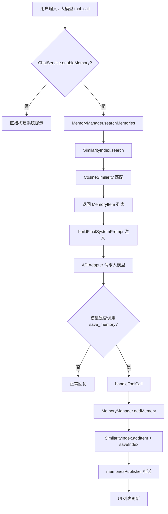

# ETOS LLM Studio 长期记忆系统原理白皮书
文档版本：v1.0（自动生成）
撰写时间：$(/bin/date '+%Y-%m-%d %H:%M:%S')
适用代码快照：仓库当前工作区
撰写者：Codex 代理
读者对象：业务负责人、iOS/Swift 开发者、算法与基础设施合作伙伴

## 文档范围
本白皮书聚焦 Shared 模块内 MemoryManager + SimilaritySearch + ChatService 的长期记忆链路。
目标是让阅读者在不查阅源码的情况下理解管线设计、运行机制与边界。
文档覆盖初始化、写入、检索、持久化、上下游接口以及未来演进。
暂不涉及 UI 呈现细节与第三方大模型网络协议。
所有内容均基于 Shared/Shared 目录的 Swift 源码分析。
若仓库未来出现重大结构调整，请同步更新此文档。

## 名词速查
长期记忆：指用户对话中被筛选后进入向量索引的知识片段。
MemoryItem：在 Models.swift 定义的结构体，存储 id、content、embedding、createdAt。
SimilarityIndex：SimilaritySearch 子模块的核心索引类，负责编码、搜索、CRUD 与持久化编排。
NativeEmbeddings：封装 NaturalLanguage 框架的句子向量生成器，支持 zh-Hans 回落策略。
JsonStore：VectorStoreProtocol 的 JSON 实现，将索引数据落盘到 Application Support 目录。
MemoryManager：共享层的门面，序列化初始化、同步 UI 发布者、执行增删查改与保存。
ChatService：业务中枢，决定何时读写记忆并在系统提示中注入命中的记忆条目。
save_memory 工具：由 ChatService 暴露给大模型的非阻塞工具，使模型可主动写入长期记忆。
memoriesPublisher：MemoryManager 暴露的 Combine 流，供 UI 订阅列表变化。
memoryTopK：UserDefaults 中控制检索条数的配置键，默认回退为 3。

## 系统鸟瞰
长期记忆系统是“感知-存储-召回”三段式管线。
感知阶段依赖 ChatService 对用户输入和工具调用的分析。
存储阶段由 MemoryManager 与 SimilarityIndex 完成文本向量化与持久化。
召回阶段由 MemoryManager.searchMemories 和 ChatService.buildFinalSystemPrompt 联手完成。
所有持久化文件写入沙盒 Application Support/com.ETOS.LLM.Studio/etos-memory-index.json。
业务层不直接触碰向量存储，统一通过 MemoryManager 交互。
NativeEmbeddings 当前使用系统级 NLEmbedding，适配 zh-Hans，并提供 fallback 到英文。
余弦相似度（CosineSimilarity）是唯一启用的度量函数，位于 DistanceMetrics.swift。
JsonStore 通过 JSONEncoder/Decoder 序列化 IndexItem 数组。
整个系统的并发控制由 Swift Concurrency + Combine 分别负责异步和订阅两条链。

## 组件分层
iOS/watchOS UI 层负责展示记忆列表并触发写入按钮或工具。
Shared 层的 ChatService 协调用户消息、模型回复、工具调用与记忆读写。
MemoryManager 作为门面，屏蔽 SimilarityIndex 的实现细节给上层。
SimilarityIndex 汇聚 EmbeddingsProtocol、DistanceMetricProtocol、VectorStoreProtocol。
NativeEmbeddings 负责生成固定维度的向量，依赖 NaturalLanguage 和 CoreML。
CosineSimilarity 在 Accelerate 框架中计算点积、范数并输出匹配度。
JsonStore 使用 FileManager 写入 JSON 文件并负责枚举历史索引。
Persistence.swift 仅负责聊天记录，与记忆系统解耦，但同样使用 Documents 目录。
Models.swift 提供 MemoryItem、InternalToolDefinition 等结构，形成数据契约。
Combine 的 CurrentValueSubject 用于让 UI 第一时间获得记忆增删后的快照。
Logger 来自 os.log，用于在控制台标识 MemoryManager 关键事件。

## 数据生命周期概述
初始化：App 启动时 MemoryManager 单例创建，异步加载索引。
写入：save_memory 工具或 UI 调用 addMemory，通过 SimilarityIndex 生成 embedding 并保存。
持久化：每次更新后 MemoryManager.saveIndex 在串行队列中调用 SimilarityIndex.saveIndex。
检索：ChatService.sendAndProcessMessage -> executeMessageRequest -> memoryManager.searchMemories。
融合：buildFinalSystemPrompt 将记忆格式化为 <memory> 块注入系统提示。
清理：deleteMemories 会逐条调用 SimilarityIndex.removeItem 并触发保存。
发布：internalMemoriesPublisher 发送更新，memoriesPublisher 提供转换排序后的 MemoryItem 列表。
配置：memoryTopK 决定 searchMemories 的 top K，0 表示返回全部。
回退：如果 NativeEmbeddings 无法加载语言模型，会记录错误并返回空向量。

## 初始化阶段细节
MemoryManager.init 会立即创建 Task，调用 await setup()。
setup() 先构建 NativeEmbeddings(language: .simplifiedChinese)。
SimilarityIndex 以 name="etos-memory-index" 初始化，使用 JsonStore 和 CosineSimilarity。
SimilarityIndex.setupDimension 会对句子“测试句子”编码以确定 embedding 维度。
loadIndex 尝试从默认路径读取 JSON，成功则填充 indexItems 并发出事件。
加载失败时 internalMemoriesPublisher 会得到 []，同时记录错误日志。
MemoryManager.waitForInitialization() 可在测试中等待异步完结。
ChatService 在初始化时注入 MemoryManager.shared 并保持引用。
测试构造函数 internal init(testIndex:) 允许注入自定义 SimilarityIndex 以隔离 IO。
初始化过程中若 similarityIndex 尚未准备好，所有公开操作都会先 await initializationTask.value。

## 写入路径详解
写入入口可以是 UI 的“添加记忆”按钮，也可以是大模型通过 save_memory 工具。
ChatService.handleToolCall 解析 JSON 参数 SaveMemoryArgs，调用 memoryManager.addMemory。
addMemory 首先等待 initializationTask 完成，规避早期竞态。
输入文本会被 trim，若为空则直接返回。
MemoryManager 为每条记忆生成 UUID 字符串作为 SimilarityIndex 的 id。
metadata 仅包含 createdAt 字段，格式为 ISO8601 字符串。
SimilarityIndex.addItem 在内部调用 getEmbedding 确认 embedding 维度正确。
当 embedding 为空或维度不匹配时，会调用 indexModel.encode(sentence: text)。
NativeEmbeddings.ModelActor.vector(for:) 调用 NLEmbedding.sentenceEmbedding。
向量生成失败时 getEmbedding 返回全零数组，保证维度一致性。
indexItems 通过 append 添加，未进行去重，依赖调用方保证语义。
MemoryManager 接着将 indexItems 转换为 MemoryItem 序列并发送给 internalMemoriesPublisher。
saveIndex() 被异步派发到 persistenceQueue，调用 similarityIndex.saveIndex。
JsonStore.saveIndex 将 IndexItem 数组编码为 JSON 并写入 etos-memory-index.json。
saveIndex 的日志包含“💾 记忆索引已保存”或错误消息。

## 删除与更新路径
updateMemory 会调用 similarityIndex.updateItem 并重新发布列表。
updateItem 若提供了新的 embedding，会检查 dimension 是否一致。
deleteMemories 遍历 MemoryItem 数组并调用 similarityIndex.removeItem。
删除和更新同样会调用 saveIndex()，维持磁盘与内存一致。
removeItem 内部使用 removeAll 过滤 id。

## 检索路径详解
检索入口位于 ChatService.executeMessageRequest。
当 enableMemory 为 true 且 userMessage 存在时，系统会读取 memoryTopK 配置。
memoryTopK==0 时表示不限制条数，将返回所有命中项。
MemoryManager.searchMemories 会 await initializationTask 并确定 topK。
SimilarityIndex.search 对 query encode 得到 queryEmbedding。
indexMetric.findNearest 计算与所有 indexItems.embedding 的余弦相似度。
sortedScores 使用 Collection.topK 仅返回得分最高的若干项。
search 返回 SearchResult 数组包含 score、text、metadata。
MemoryManager 将 SearchResult 转换为 MemoryItem，但 embedding 字段置为空数组。
searchMemories 返回的 MemoryItem 会按 createdAt 默认顺序（SearchResult 未排序时 keep order）。
ChatService 额外调用 Array(prefix:) 以截断为最终 topK。
如果无可用模型或适配器，流程会提前终止并提示错误，不会调用大模型。

## Prompt 注入与上下文融合
buildFinalSystemPrompt 接收 global 系统提示、session topicPrompt 与命中记忆。
当 global 不为空时会生成 <system_prompt> 包裹的段落。
当 topicPrompt 不为空时会生成 <topic_prompt> 段落。
记忆集合会被映射为“- (时间): 内容”列表，放在 <memory> 区域。
< memory > 区域包含中文说明提醒模型谨慎引用，避免误当系统指令。
最终系统提示通过空行拼接多个块，并作为 role=.system 消息发送给模型。
若 enableMemory 关闭，系统提示不包含记忆片段。

## 工具与 Agent 协同
save_memory 工具定义在 ChatService.saveMemoryTool，isBlocking=false。
工具参数 Schema 使用 JSONValue 字典描述，只要求 content 字段。
当模型返回 tool_calls，handleToolCall 负责解析并调用 MemoryManager。
工具的执行结果会封装为 ChatMessage(role: .tool) 并附加在对话中。
attachToolResult 会将工具结果回写到 loadingMessage 的 toolCalls 列表，供 UI 展示。
可写记忆必须同时开启 enableMemory 与 enableMemoryWrite 标志，否则 tools=nil。

## 持久化与文件布局
SimilarityIndex.getDefaultStoragePath 会取 Application Support/BundleID。
BundleID 默认是 com.ETOS.LLM.Studio。
文件命名规则：<indexName>.json，当前 indexName 为 etos-memory-index。
JsonStore.listIndexes 会遍历目录下所有 .json 文件，可支持多个版本共存。
数据格式是 IndexItem 数组的 JSON，包含 id/text/embedding/metadata。
MemoryManager.saveIndex 使用串行队列，避免多线程同时写文件。
加载阶段使用 similarityIndex.loadIndex 并回填 indexItems。

## 合规与安全控制
MemoryManager 不包含任何明文凭证，只接受调用方提供的文本。
写入目录位于沙盒 Application Support，默认开启完整文件保护。
metadata 中仅保存 createdAt，不存储用户标识，降低隐私风险。
ChatService 在构建 <memory> 区块时声明“仅供参考”，避免模型误引用敏感信息。
未授权时 enableMemoryWrite=false，可运行只读模式。

## 性能与可观测性
NativeEmbeddings 和 SimilarityIndex.search 全部运行在本地，不依赖网络。
addItems 在批量导入时使用 TaskGroup 加速并行编码。
CosineSimilarity 利用 Accelerate.vDSP 执行点积和范数。
MemoryManager 的 persistenceQueue 是串行队列，避免文件写入冲突。
internalMemoriesPublisher + CurrentValueSubject 可用于在 UI 中绑定列表刷新，从而可视化写操作影响。
os.log Logger 输出 emoji 标记的日志，便于在 Console.app 中筛选。

## 风险与边界
系统依赖 Apple 的 NLEmbedding 语料，iOS 17 以后 zh-Hans 模型可能缺失。
若向量编码失败，系统会记录错误并以全零向量占位，可能降低搜索效果。
ChatService 未对重复内容去重，可能产生大量相似记忆。
JsonStore 缺乏版本控制，未来 schema 变更需要迁移脚本。
当前没有自动淘汰策略，记忆库只会增长。

## 未来演进建议
1. 引入自定义本地或服务器端 embedding 模型，避免系统依赖。
2. 在 MemoryManager 层加入语义去重或重要性评分。
3. 扩展 VectorStoreProtocol，增加 SQLite / CoreData / Milvus 等后端。
4. 在 save_memory 工具协议中加入分类标签，支持多索引分片。
5. 为 memoryTopK 提供 UI 控件，降低配置门槛。
6. 将记忆命中与回复质量的关系接入遥测系统。
7. 支持在 ChatService 中按会话或话题过滤记忆。
8. 为 MemoryItem 增加来源字段，记录是谁触发的存储。
9. 在 SimilarityIndex 中缓存 queryEmbedding，优化重复查询。
10. 提供批量导入导出脚本，方便迁移。

## Mermaid 数据流

## 结语
以上内容对 Shared 层长期记忆子系统进行了逐段拆解。
如需将此设计引入其他平台，可复用 MemoryManager + SimilarityIndex 组合。
欢迎在 PR 中引用本白皮书章节，便于评审共识。

## 时序剖析
阶段一（应用冷启动）
1. Shared 框架被加载，MemoryManager.shared 构造函数被调用。
2. initializationTask 捕获 setup()，在后台线程中启动。
3. NativeEmbeddings.ModelActor 初始化时尝试加载 zh-Hans 句向量表。
4. 如果 zh-Hans 不可用，会尝试 fallbackLanguage（默认为英文）。
5. SimilarityIndex.setupDimension 执行一次 encode 以确定向量维度。
6. loadIndex 从 Application Support 定位 etos-memory-index.json。
7. JsonStore.loadIndex 成功时返回 IndexItem 数组，MemoryManager 发布事件。
8. UI 若订阅 memoriesPublisher，将收到初始数据流。
阶段二（用户发送第一条消息）
9. ChatService.sendAndProcessMessage 写入 userMessage 与 loadingMessage。
10. 若当前会话为临时，则在 Persistence 中保存，并将会话升序。
11. requestStatusSubject 发送 .started，UI 可显示加载指示。
12. executeMessageRequest 判断 enableMemory 开关，必要时触发检索。
13. memoryManager.searchMemories await 初始化完成，再执行 SimilarityIndex.search。
14. ChatService 将命中结果传入 buildFinalSystemPrompt。
15. Adapter 构造请求，network 层开始与模型交互。
16. 模型若返回 tool_calls，则 handleToolCall 异步执行。
17. save_memory 工具写入记忆后，memoriesPublisher 推送更新。
18. handleStreamedResponse 或 handleStandardResponse 处理模型回复。
19. processResponseMessage 负责写入最终消息并保存历史。
阶段三（会话后期维护）
20. 用户可在记忆管理界面删除多条记忆，MemoryManager.deleteMemories 执行。
21. 删除后 persistenceQueue 调用 saveIndex 产生日志。
22. memoryTopK 可以在设置页调整，影响后续检索数量。
23. 若用户关闭 enableMemory，系统提示将不再包含记忆块。

## 关键 API 解析
MemoryManager.memoriesPublisher：CurrentValueSubject<[IndexItem],Never> 映射到 MemoryItem 列表。
MemoryManager.addMemory：公开异步方法，负责写入向量索引并触发保存。
MemoryManager.updateMemory：更新文本内容，保持 metadata 不变。
MemoryManager.deleteMemories：支持批量删除，内部遍历调用 SimilarityIndex.removeItem。
MemoryManager.getAllMemories：读取内存中全部索引项并按 createdAt 排序。
MemoryManager.searchMemories：封装 SimilarityIndex.search，并支持 topK==0 返回全集。
MemoryManager.waitForInitialization：测试钩子，生产场景一般不用。
SimilarityIndex.addItem：负责编码、构造 IndexItem 并插入内存数组。
SimilarityIndex.addItems：批量导入工具，借助 TaskGroup 并行处理。
SimilarityIndex.search：执行 query 编码、相似度计算与结果映射。
SimilarityIndex.saveIndex：调用 VectorStoreProtocol.saveIndex 写入磁盘。
SimilarityIndex.loadIndex：从磁盘读取 JSON 后填充 indexItems。
SimilarityIndex.getEmbedding：复用已有 embedding 或重新编码。
SimilarityIndex.updateItem：允许同时更新 text、embedding、metadata。
SimilarityIndex.removeItem：根据 id 移除条目。
JsonStore.saveIndex：使用 JSONEncoder 编码，文件名追加 .json 后缀。
JsonStore.loadIndex：解码 IndexItem 数组，错误会上抛。
JsonStore.listIndexes：过滤目录中所有 .json 文件。
ChatService.saveMemoryTool：生成 InternalToolDefinition，供模型调用。
ChatService.handleToolCall：解析工具参数并执行 MemoryManager.addMemory。
ChatService.buildFinalSystemPrompt：将 global/topic/memory 拼接为 XML 样式字符串。
ChatService.resolvedMemoryTopK：从 UserDefaults 解析整型数值，默认 3。

## 配置项与默认值
UserDefaults.enableMemory：未显式定义时依赖 UI 层默认值，本文默认开启。
UserDefaults.enableMemoryWrite：控制模型是否能触发 save_memory，默认关闭以防滥用。
UserDefaults.memoryTopK：整型或字符串，负值会被归零。
UserDefaults.selectedRunnableModelID：影响 ChatService 发送时使用的模型。
UserDefaults.speechModelIdentifier：与语音识别有关，但也共用 RunnableModel 列表。
Bundle Identifier：默认为 com.ETOS.LLM.Studio，影响存储目录。
indexName：MemoryManager 固定传入 etos-memory-index，可在未来扩展多索引。
NLEmbedding 语言：默认 simplifiedChinese，fallback 为英文。
CosineSimilarity：当前唯一的 DistanceMetricProtocol 实现。
VectorStore：JsonStore，为轻量级原生实现。

## 调试与观测建议
1. 通过 Console.app 过滤 subsystem=com.ETOS.LLM.Studio 查看记忆日志。
2. 在模拟器中删除 Application Support/com.ETOS.LLM.Studio 目录可重置记忆库。
3. 使用 Xcode 的 Combine 调试工具订阅 memoriesPublisher，观察实时变化。
4. 通过 UserDefaults Suite 手动修改 memoryTopK，验证检索范围。
5. 若怀疑 embedding 失败，可在 SimilarityIndex.getEmbedding 添加断点，检查返回向量。
6. 检查 save_memory 工具调用链时，可在 handleToolCall 内设置捕获点。
7. 若 JSON 文件损坏，JsonStore.loadIndex 会抛错，可在 setup 阶段观察日志。
8. 使用 Instruments 的 Allocations 模板监控 indexItems 增长是否导致内存飙升。
9. 通过 os_log_type_enabled 动态开启 debug 日志，便于现场排查。
10. 单元测试可注入 testIndex，避免真实 IO，提高稳定性。

## 常见问题 FAQ
Q: 为什么需要 MemoryManager，而不是直接调用 SimilarityIndex？
A: MemoryManager 提供线程安全、发布者、持久化以及元数据管理的一站式封装，减少上层心智负担。
Q: 如果我想支持多语言记忆怎么办？
A: 可在 MemoryManager.setup 中选择不同语言的 NativeEmbeddings，或实现新的 EmbeddingsProtocol。
Q: memoryTopK 设置为 0 会怎么样？
A: ChatService 会把 similarityIndex.indexItems 全部返回，适合调试但可能造成长上下文。
Q: save_memory 工具失败会怎样？
A: handleToolCall 会返回一条 role=.tool 的错误消息，同时不会污染索引。
Q: 记忆文件存哪里？
A: Application Support/com.ETOS.LLM.Studio/etos-memory-index.json（由 SimilarityIndex 保存）。
Q: 如何清空记忆？
A: 可调用 MemoryManager.deleteMemories(getAllMemories())，或手动删除 JSON 文件后重启应用。
Q: embedding 依赖在线模型吗？
A: 不依赖，全部使用本地 NLEmbedding，因此离线可用。
Q: 我能不能把记忆同步到云端？
A: 目前没有现成实现，可以扩展 VectorStoreProtocol 接入云端数据库。
Q: 记忆写入会阻塞 UI 吗？
A: addMemory 本身是异步的，持久化跑在串行队列中，UI 只在内存列表更新时刷新。
Q: 记忆可否附加标签？
A: 当前 schema 只有 metadata 字典，你可以在 metadata 中扩展自定义字段，但需要更新 UI 解析逻辑。

## 测试策略建议
1. 单元测试：使用 MemoryManager(testIndex:) 注入内存索引，验证 add/update/delete/search 行为。
2. 集成测试：通过 ChatService.sendAndProcessMessage 构造 enableMemory=true 的场景，断言系统提示包含 <memory>。
3. 回归测试：在 SharedTests 中模拟 save_memory 工具链，确保 tool result 正确回写。
4. 性能测试：构造 1k 级记忆条目，度量 searchMemories 的延迟与内存占用。
5. 容错测试：伪造损坏的 etos-memory-index.json，确认系统能回退到空索引并记录日志。
6. 并发测试：同时触发多个 addMemory 调用，确认 persistenceQueue 避免数据竞争。
7. UI 测试：确保 memoriesPublisher 更新时列表不会闪烁或崩溃。
8. 人工验证：在模拟器中查看文件系统，确认 JSON 文件已更新。
9. 安全测试：审查 metadata，确保不会意外写入 API 密钥等敏感字段。
10. 国际化测试：尝试使用英文/日文内容，验证 embeddings 维度一致。

